# Esquema de la base de datos

> **Fuente única de verdad del modelo de datos.**
> Los cambios se ejecutan en el SQL Editor de Supabase (regla «Los cambios de BD
> se hacen en la interfaz» de [CLAUDE.md](../CLAUDE.md)), así que este documento
> es lo único que le da
> contexto a quien trabaje después sobre qué existe en la base y por qué.
> **Todo cambio se refleja aquí en el mismo commit que su archivo SQL.**

- **Motor:** PostgreSQL 15+ (Supabase, proyecto `sovinakodrmgxytgapry`)
- **Estado:** ✅ **ejecutado en Supabase**
- **Última migración aplicada:** `0018_semester_weeks.sql` (2026-09-25).
  `0019_student_dossier_read.sql` está escrita y documentada aquí pero
  **todavía no se pega en Supabase**.
- **Datos del Sheets:** importados (46 alumnos, 580 entregas), incluidas las dos
  bitácoras semanales.

## Índice

1. [Alcance](#alcance)
2. [Principios de diseño](#principios-de-diseño)
3. [Diagrama entidad-relación](#diagrama-entidad-relación)
4. [Autenticación y roles](#autenticación-y-roles)
5. [Tipos enumerados](#tipos-enumerados)
6. [Tablas núcleo](#tablas-núcleo)
7. [Módulo 1 — Conócete](#módulo-1--conócete)
8. [Módulo 2 — Actúa](#módulo-2--actúa)
9. [Bitácoras semanales](#bitácoras-semanales)
10. [Semanas del semestre](#semanas-del-semestre)
11. [Fechas de entrega y estado de las entregas](#fechas-de-entrega-y-estado-de-las-entregas)
12. [Sincronización con el Sheets](#sincronización-con-el-sheets)
13. [Vistas](#vistas)
14. [Índices](#índices)
15. [Seguridad](#seguridad)
16. [Correspondencia migración → contenido](#correspondencia-migración--contenido)

---

## Alcance

Esta versión cubre **autenticación**, los **11 formularios del Módulo 1 y 2**
(`form1_0` … `form2_7`) y los **dos apéndices** (`formA_1`, `formB_1`).

**Deliberadamente fuera**, para incorporarse después:

| Qué | Por qué no está |
|---|---|
| Hoja `alumnos` del Sheets | Los alumnos se derivan de los correos que responden formularios |
| Catálogos `periods`, `degree_programs`, `modules` | Por ahora esos valores son `text` |

`form_deadlines` ya no está en esta lista: `0017_form_deadlines.sql` la agrega,
junto con el estado *a tiempo / tarde / pendiente / sin fecha*. Ver
[Fechas de entrega y estado de las entregas](#fechas-de-entrega-y-estado-de-las-entregas).
A diferencia de la hoja `fechas_entrega` del Sheets, que nunca se importó, las
reglas de `form_deadlines` las escribe el profesor desde el Panel de
Administrador — no vienen del Sheets.

Los apéndices ya tienen **tabla y pantalla**. Las bitácoras semanales
(`form_busqueda`, `form_practicas`) entran con `0011`: son los únicos
formularios de respuesta múltiple y no se muestran como pantalla propia, sino
dentro del expediente del alumno.

---

## Principios de diseño

### 1. El correo institucional es la llave natural

El sistema actual en Apps Script relaciona **todas** las respuestas por el correo
institucional del alumno (`idCorreo`), repetido en cada hoja. Aquí se conserva esa
llave, pero normalizada:

- `students.institutional_email` (`citext UNIQUE`) es la llave natural y lo que se
  usa al importar desde el Sheets.
- `students.id` (`uuid`) es lo que usan las relaciones, para que cambiar un correo
  no rompa las entregas.

**La lista de alumnos se deriva de los formularios.** No se importa la hoja
`alumnos`: todo correo que responde un formulario es, por definición, un alumno.
En los datos actuales eso da **46 alumnos** (4 más que la hoja `alumnos`, que
estaba desactualizada). Por eso no existe una tabla de respuestas huérfanas.

### 2. `submissions` es la tabla central

Toda respuesta crea una fila en `submissions`, y las tablas de respuestas cuelgan
de `submission_id`, nunca de `student_id`.

**Un alumno puede tener N respuestas del mismo formulario.** Hoy los 11
formularios traen una sola respuesta por alumno, pero un reenvío no debe
sobrescribir la anterior y las bitácoras semanales lo van a necesitar.

> **Nunca** agregar `UNIQUE (student_id, form_code)`.

### 3. Nadie ve nada sin ser administrador

Las políticas exigen `is_admin()`, no `authenticated`. Un usuario recién
registrado puede iniciar sesión y no ve absolutamente ningún dato. Ver
[AUTH.md](AUTH.md).

### 4. Fidelidad con el origen donde conviene

`skills_assessment` usa 33 columnas anchas, réplica exacta de la hoja `form1_4`,
en lugar de una tabla normalizada. Agregar una habilidad requiere `ALTER TABLE`.

---

## Diagrama entidad-relación

```mermaid
erDiagram
    AUTH_USERS ||--|| PROFILES     : "1 a 1"
    STUDENTS   ||--o{ SUBMISSIONS  : "entrega"
    FORMS      ||--o{ SUBMISSIONS  : "recibe"

    SUBMISSIONS ||--o| DEMOGRAPHICS      : "1.0"
    SUBMISSIONS ||--o| HOLLAND_RESULTS   : "1.1"
    SUBMISSIONS ||--o| MBTI_RESULTS      : "1.2"
    SUBMISSIONS ||--o| DISC_RESULTS      : "1.3"
    SUBMISSIONS ||--o| SKILLS_ASSESSMENT : "1.4"
    SUBMISSIONS ||--o| VALUES_RESULTS    : "1.5"
    SUBMISSIONS ||--o| REFLECTIONS       : "2.1 2.2 2.4 2.5"
    SUBMISSIONS ||--o| INDEED_RESEARCH   : "2.7"
    SUBMISSIONS ||--o| INTERNSHIP_APPLICATIONS : "A.1"
    SUBMISSIONS ||--o| COMPANY_PROFILES        : "B.1"
    SUBMISSIONS ||--o| JOB_SEARCH_LOGS : "bitácora semanal"
    SUBMISSIONS ||--o| INTERNSHIP_LOGS : "bitácora semanal"

    FORMS ||--o{ SHEET_ROWS : "staging del Sheets"
    FORMS ||--o{ FORM_DEADLINES : "fecha límite"

    AUTH_USERS {
        uuid id PK "lo administra Supabase"
        text email
    }
    PROFILES {
        uuid id PK "= auth.users.id"
        citext email UK
        text full_name
        app_role role "admin | pendiente"
        boolean is_active
    }
    STUDENTS {
        uuid id PK
        citext institutional_email UK "llave natural"
    }
    FORMS {
        text code PK "form1_0 … form_practicas"
        text module_code "1 | 2 | A | B | W"
        text name_es
        text name_en
        numeric display_order
        text response_table
    }
    SUBMISSIONS {
        uuid id PK
        uuid student_id FK
        text form_code FK
        timestamptz submitted_at
        language language
        text source_row_key UK "idempotencia"
        date week_start "solo bitácoras"
        date week_end "solo bitácoras"
    }
    JOB_SEARCH_LOGS {
        uuid submission_id PK
        text activities
        text applications
        text interviews
        text learnings
        text next_steps
    }
    INTERNSHIP_LOGS {
        uuid submission_id PK
        text activities
        numeric hours_worked
        text skills_practiced
        text proposal
    }
    DEMOGRAPHICS {
        uuid submission_id PK
        text full_name
        text student_number
        citext personal_email
        date birth_date
        text birth_country
        gender gender
        text degree_code
        smallint semester
        text period_code
        session_day session_day
    }
    HOLLAND_RESULTS {
        uuid submission_id PK
        holland_type first_type
        holland_type second_type
        holland_type third_type
        text holland_code
        smallint first_score
        smallint second_score
        smallint third_score
    }
    MBTI_RESULTS {
        uuid submission_id PK
        mbti_type mbti_type
        mbti_identity identity
        mbti_energy energy
        mbti_mind mind
        mbti_nature nature
        mbti_tactics tactics
        text report_url
    }
    DISC_RESULTS {
        uuid submission_id PK
        text disc_style
        text disc_category
        text explanation
        boolean needs_review
    }
    SKILLS_ASSESSMENT {
        uuid submission_id PK
        skill_level x33_habilidades
        boolean is_pefista_graduating
    }
    VALUES_RESULTS {
        uuid submission_id PK
        text_array top_values
        smallint score
        text report_url
    }
    REFLECTIONS {
        uuid submission_id PK
        boolean was_useful
        text reason
    }
    INDEED_RESEARCH {
        uuid submission_id PK
        text positions
        text companies
    }
    INTERNSHIP_APPLICATIONS {
        uuid submission_id PK
        smallint required_hours
        text company_name
        text company_tax_id
        smallint company_founded_year
        citext supervisor_email
        text supervisor_phone
        boolean is_paid
    }
    SHEET_ROWS {
        bigint id PK
        text form_code FK "la hoja del Sheets"
        jsonb payload "la fila cruda, sin normalizar"
        text row_hash UK "md5(payload), generada"
        timestamptz ingested_at
        timestamptz imported_at "NULL = pendiente"
    }
    COMPANY_PROFILES {
        uuid submission_id PK
        text company_name
        text industry
        text work_schedule
        citext supervisor_email
        text supervisor_phone
        boolean has_contract
        numeric salary
        int linkedin_connections
    }
    FORM_DEADLINES {
        uuid id PK
        text form_code FK
        language language "NULL = todos"
        session_day session_day "NULL = todas"
        text period_code "NULL = todos"
        timestamptz due_at
        timestamptz created_at
    }
```



> `AUTH_USERS` es `auth.users`, del esquema que administra Supabase. No se
> modifica nunca; `profiles` se le engancha por `id`.

---

## Autenticación y roles

Detalle completo en [AUTH.md](AUTH.md). Resumen del modelo:

### `profiles`

| Columna | Tipo | Notas |
|---|---|---|
| `id` | `uuid` PK → `auth.users(id)` ON DELETE CASCADE | mismo id que Supabase Auth |
| `email` | `citext` NOT NULL UNIQUE | |
| `full_name` | `text` | |
| `role` | `app_role` NOT NULL DEFAULT `'pendiente'` | |
| `is_active` | `boolean` NOT NULL DEFAULT `true` | |
| `student_id` | `uuid` → `students(id)` ON DELETE SET NULL | el alumno de la cuenta; `NULL` en el profesor. Único entre los no nulos |
| `created_at` / `updated_at` | `timestamptz` NOT NULL DEFAULT `now()` | |

### `app_role`

`admin` · `alumno` · `pendiente`

`pendiente` es el rol con el que nace todo usuario. Puede iniciar sesión y no ve
nada. Roles futuros se agregan con `ALTER TYPE app_role ADD VALUE`, y en su
**propio archivo**: PostgreSQL no deja usar un valor de enum en la misma
transacción que lo agregó. Por eso `alumno` viene solo en `0013`.

`alumno` hoy es un rol sin lectura: no hay una sola política que lo mencione, así
que un alumno con sesión no ve ni una fila —ni la suya—. Solo existen su cuenta y
su pantalla de bienvenida. Las políticas `student_id = current_student_id()`
llegan cuando lleguen sus pantallas de datos.

### Funciones y triggers

| Objeto | Qué hace |
|---|---|
| `is_admin()` | `SECURITY DEFINER`. Base de todas las políticas |
| `handle_new_user()` | Trigger sobre `auth.users`: crea el perfil en `pendiente` |
| `guard_profile_role()` | Trigger sobre `profiles`: protege la columna `role` |
| `current_student_id()` | `SECURITY DEFINER`. El alumno de la sesión, o `NULL`. Base de las políticas «lo mío» |
| `current_student_period()` | `SECURITY DEFINER`, `0018`. El `period_code` del alumno de la sesión, o `NULL`. Base de `semester_weeks_select_own` |
| `create_student_accounts()` | Alta masiva de cuentas de alumno. Sin permiso de ejecución para `authenticated`; la llama `import_sheet_rows()` en cada sincronización (`0021`), y sigue disponible para correrla a mano en el SQL Editor |

**Por qué `is_admin()` es `SECURITY DEFINER`:** se invoca desde la política de
`profiles`; si consultara `profiles` con los permisos de quien llama, dispararía
esa misma política y Postgres entraría en recursión infinita. `SECURITY DEFINER`
se salta RLS dentro de la función y corta el ciclo. Además lleva
`set search_path = ''` para que nadie pueda suplantar `public.profiles` con un
esquema propio.

**Por qué existe `guard_profile_role()`:** RLS decide qué *filas* se pueden
modificar, pero no qué *columnas*. Sin este trigger, un usuario con permiso de
editar su propio perfil podría ascenderse a `admin`.

---

## Tipos enumerados

| Tipo | Valores | Origen en el Sheets |
|---|---|---|
| `app_role` | `admin`, `pendiente` | — (propio de la app) |
| `language` | `es`, `en` | `Español`, `Inglés` |
| `session_day` | `lunes`, `miercoles` | `Lunes`, `Miércoles` |
| `gender` | `femenino`, `masculino`, `otro`, `no_especificado` | `Femenino`, `Femenine`, `Masculino` |
| `skill_level` | `novato`, `principiante`, `intermedio`, `avanzado`, `experto` | idénticos |
| `holland_type` | `R`, `I`, `A`, `S`, `E`, `C` | `R (Realista)`, … |
| `mbti_type` | los 16 tipos (`INTJ` … `ESFP`) | 16 columnas en español |
| `mbti_energy` | `extravertido`, `introvertido` | `Extravertido`, `Extrovertido` |
| `mbti_mind` | `intuitivo`, `observador` | idénticos |
| `mbti_nature` | `pensamiento`, `emocional` | idénticos |
| `mbti_tactics` | `juzgador`, `prospeccion` | `Juzgador`, `Prospección` |
| `mbti_identity` | `asertivo`, `cauteloso` | idénticos |
| `submission_state` | `a_tiempo`, `tarde`, `pendiente`, `sin_fecha` | — (lo calcula `submission_status()`, `0017`) |

> **El orden de `skill_level` importa**: define `<`, `>`, `ORDER BY` y `max()`.
> Va de menor a mayor dominio.

---

## Tablas núcleo

### `students`

| Columna | Tipo | Notas |
|---|---|---|
| `id` | `uuid` PK DEFAULT `gen_random_uuid()` | |
| `institutional_email` | `citext` NOT NULL **UNIQUE** | llave natural, `@udem.edu` |
| `created_at` / `updated_at` | `timestamptz` NOT NULL DEFAULT `now()` | |

Tabla mínima a propósito. El nombre, matrícula, carrera, semestre, periodo y
frecuencia **no viven aquí**: llegan en el formulario 1.0 y viven en
`demographics`. La app los lee con `v_students_directory`.

### `forms`

Catálogo de los 11 formularios. Ver [FORMS_CATALOG.md](FORMS_CATALOG.md).

| Columna | Tipo | Notas |
|---|---|---|
| `code` | `text` PK | `form1_0`, `form2_7` — los códigos del Sheets |
| `module_code` | `text` NOT NULL CHECK `in ('1','2')` | |
| `name_es` / `name_en` | `text` NOT NULL | |
| `display_order` | `numeric(4,1)` NOT NULL | `1.0`, `2.7` — ordena el sidebar |
| `response_table` | `text` | dónde viven las respuestas |

### `submissions`

| Columna | Tipo | Notas |
|---|---|---|
| `id` | `uuid` PK DEFAULT `gen_random_uuid()` | |
| `student_id` | `uuid` NOT NULL FK → `students.id` ON DELETE CASCADE | |
| `form_code` | `text` NOT NULL FK → `forms.code` | |
| `submitted_at` | `timestamptz` NOT NULL | `marcaTemporal` del Sheets |
| `language` | `language` | idioma en que se respondió |
| `source_row_key` | `text` UNIQUE | idempotencia de importación |
| `week_start` | `date` | **solo bitácoras.** `inicioSemana`; `NULL` en los otros 11 formularios |
| `week_end` | `date` | **solo bitácoras.** `finalSemana` |
| `created_at` | `timestamptz` NOT NULL DEFAULT `now()` | |

`UNIQUE (student_id, form_code, submitted_at)` — evita importar dos veces la
misma respuesta, **sin** limitar a una respuesta por formulario.

La semana vive aquí y no en las tablas de bitácora porque es el campo que las
**ordena**: consultar el historial de un alumno no debería obligar a unir con la
tabla de respuestas para saber en qué orden van.

`CHECK submissions_semana_plausible` acota las dos fechas a 2000–2100. **No** hay
check de `week_end >= week_start`: 6 de 183 entregas reales traen el rango
invertido y otras 12 duran entre 12 y 365 días. Son errores de captura del alumno
y el profesor necesita verlos tal como se enviaron. El check de años existe por
otra razón: atrapa la corrupción de fechas de Excel, que produce fechas de 1900.

---

## Módulo 1 — Conócete

Todas comparten `submission_id uuid PRIMARY KEY REFERENCES submissions(id) ON DELETE CASCADE`.

### `demographics` — 1.0 (`form1_0`)

| Columna | Tipo | Origen |
|---|---|---|
| `full_name` | `text` | `nombre` |
| `student_number` | `text` | `matricula` — **`text`**: es un identificador |
| `personal_email` | `citext` | `correoPersonal` |
| `birth_date` | `date` | `fechaNacimiento` |
| `birth_country` | `text` | `paisNacimiento` — texto libre (`Mexico`, `MX`, …) |
| `gender` | `gender` | `sexo` |
| `degree_code` | `text` | `carrera` — sin catálogo en esta iteración |
| `semester` | `smallint` CHECK 1–12 | `semestre` (`6to` → `6`) |
| `period_code` | `text` | `periodo` |
| `session_day` | `session_day` | `frecuencia` |

### `holland_results` — 1.1 (`form1_1`)

`first_type` / `second_type` / `third_type` (`holland_type`),
`holland_code` (`text` CHECK `^[RIASEC]{3}$`),
`first_score` / `second_score` / `third_score` (`smallint`).

### `mbti_results` — 1.2 (`form1_2`)

`report_url`, `mbti_type`, `identity`, `energy`, `mind`, `nature`, `tactics`,
y los cinco `*_pct` (`smallint` CHECK 0–100).

Las 16 columnas en español de la hoja se colapsan en `mbti_type` + `identity`.

### `disc_results` — 1.3 (`form1_3`)

`disc_style` (`text` CHECK `^[DISC]{1,4}$`), `disc_category`, `explanation`,
`needs_review` (`boolean` NOT NULL DEFAULT `false`).

> `needs_review` marca las respuestas contaminadas del formulario de origen —
> ver [DATA_MAPPING.md](DATA_MAPPING.md).

### `skills_assessment` — 1.4 (`form1_4`)

33 columnas `skill_level` más `is_pefista_graduating boolean`:

`written_communication`, `verbal_communication`, `nonverbal_communication`,
`collaboration_teamwork`, `leadership`, `conflict_resolution`, `negotiation`,
`active_listening`, `empathy`, `customer_service`, `excel`, `sheets`, `word`,
`docs`, `powerpoint`, `slides`, `chatgpt`, `gemini`, `programming`,
`critical_thinking`, `decision_making`, `time_management`,
`planning_organization`, `research_analysis`, `project_management`,
`creativity_innovation`, `flexibility_adaptability`, `work_ethic`,
`financial_literacy`, `learning_ability`, `emotional_intelligence`,
`networking`, `sales`

### `values_results` — 1.5 (`form1_5`)

`report_url` (`text`), `top_values` (`text[]`), `score` (`smallint`).

---

## Módulo 2 — Actúa

### `reflections` — 2.1, 2.2, 2.4, 2.5

Los cuatro formularios tienen las mismas dos preguntas y comparten tabla; cuál es
se sabe por `submissions.form_code`.

| Columna | Tipo | Origen |
|---|---|---|
| `was_useful` | `boolean` | `util` (`Sí`/`Si`/`Yes` → `true`) |
| `reason` | `text` | `porque` |

### `indeed_research` — 2.7 (`form2_7`)

`positions`, `position_url_1/2/3`, `companies`, `company_url_1/2/3` — todos `text`.

`positions` y `companies` se guardan como texto multilínea tal cual: el formato lo
escribe el alumno a mano y no es fiable parsearlo.

---

## Apéndices

Definidos en `0009_appendices.sql`; sus vistas de panel en `0010_views_appendices.sql`.

> Estas dos tablas contienen datos sensibles de **terceros** —teléfonos y correos
> de jefes, RFC de empresas y sueldos—, no solo de alumnos. No se exportan ni se
> muestran fuera del panel del profesor.

### `internship_applications` — A.1 Carta Formal de Aceptación (`formA_1`)

| Columna | Tipo | Origen / nota |
|---|---|---|
| `required_hours` | `smallint` CHECK 0–2000 | `horas`. **El origen mezcla número y texto**: hay `240` y también `"480 horas voy todos los días 9am"`. Se guarda el número extraído |
| `internship_option` | `text` | `opcionesPracticas` |
| `restrictions` | `text` | |
| `company_name` / `company_website` | `text` | |
| `company_tax_id` | `text` | RFC. Sin formato validado: hay filas donde se capturó el nombre de la empresa |
| `company_founded_year` | `smallint` CHECK 1800–2100 | `anioEmpresa`. El origen trae número, texto (`"Aprox 1976"`) y fechas |
| `department` | `text` | |
| `supervisor_name` / `supervisor_role` | `text` | |
| `supervisor_email` | `citext` | |
| `supervisor_phone` | `text` | Conserva lada y separadores: `+52-833-155-6372`, `81 1468 3544` |
| `schedule` | `text` | |
| `is_paid` | `boolean` | `renumeracion` (sic) |
| `description`, `career_relation`, `professional_relation`, `company_validation` | `text` | |

### `company_profiles` — B.1 Formulario de Inicio (`formB_1`)

| Columna | Tipo | Origen / nota |
|---|---|---|
| `company_name` | `text` | `empresa` |
| `company_website` | `text` | |
| `industry` | `text` | `giro` |
| `mission`, `vision` | `text` | |
| `company_values` | `text` | **con prefijo**: `values` es palabra reservada en SQL |
| `address` | `text` | `direccionEmpresa` |
| `work_schedule` | `text` | `horarioLaboral`. **Texto descriptivo, no un número de horas**: `"Lunes a Viernes (9am a 4pm)"` |
| `department` | `text` | |
| `supervisor_info` | `text` | `datosJefe`: nombre y puesto en un solo campo |
| `supervisor_email` | `citext` | |
| `supervisor_phone` | `text` | |
| `activities` | `text` | |
| `has_contract` | `boolean` | `contrato`: `Si`/`Sí`/`Yes` |
| `salary` | `numeric(12,2)` CHECK ≥ 0 | |
| `has_linkedin_profile` | `boolean` | |
| `linkedin_connections` | `int` CHECK ≥ 0 | |
| `linkedin_url` | `text` | |

---

## Bitácoras semanales

> Migración `0011_weekly_logs.sql`. Los **únicos** formularios de respuesta
> múltiple: un alumno acumula hasta 10 entregas. Por eso `submissions` nunca
> llevó `UNIQUE (student_id, form_code)`.

No tienen pantalla propia en el rail. Se leen dentro del **expediente del
alumno**, igual que en la plataforma anterior, donde eran las secciones
«Reporte de Búsqueda» y «Reporte de Prácticas» de la tarjeta *ADN Profesional*.

La semana reportada no está en estas tablas, sino en `submissions.week_start` /
`week_end`.

### `job_search_logs` — Reporte de Búsqueda (`form_busqueda`)

| Columna | Tipo | Origen |
|---|---|---|
| `submission_id` | `uuid` PK FK → `submissions.id` ON DELETE CASCADE | |
| `activities` | `text` | `actividades` |
| `applications` | `text` | `aplicaciones` |
| `interviews` | `text` | `entrevistas` |
| `learnings` | `text` | `aprendizajes` |
| `next_steps` | `text` | `siguientesPasos` |

Todo es texto libre semanal. No se parsea a listas: el formato lo pone el alumno
y no es confiable.

### `internship_logs` — Reporte de Prácticas (`form_practicas`)

| Columna | Tipo | Origen |
|---|---|---|
| `submission_id` | `uuid` PK FK → `submissions.id` ON DELETE CASCADE | |
| `activities` | `text` | `actividades` |
| `hours_worked` | `numeric(5,1)` | `horas` |
| `skills_practiced` | `text` | `habilidades` |
| `proposal` | `text` | `propuesta` |

`hours_worked` es **decimal y no entero** porque el origen trae `'31.20'`. Excel
además convirtió 40 de las 116 celdas a fechas de 1900 —serial 20 → `1900-01-20`
→ 20 horas—; la reconversión la hace `scripts/generar_import.py`. Ver
[DATA_MAPPING.md](DATA_MAPPING.md#bitácoras-semanales).

`CHECK internship_logs_horas_plausibles` acota a 0–500. No juzga cuántas horas es
razonable trabajar (el máximo real capturado es 96): ataja lo absurdo.

> **El acumulado de horas no se guarda.** Es la suma corrida de `hours_worked` y
> se calcula al mostrarlo. Guardarlo obligaría a recalcular la columna entera
> cada vez que llega una entrega atrasada, que es justo lo que pasa con una
> bitácora.

### El alumno entrega desde el panel

> Migración `0016_student_weekly_logs.sql`.

Estas dos tablas son las **únicas** que el alumno escribe. Los otros trece
formularios se siguen contestando en Google Forms y entran por la
sincronización horaria.

Las dos vías conviven y escriben las mismas filas. Se distinguen por
`submissions.source_row_key`:

| Vía | `source_row_key` | Quién escribe |
|---|---|---|
| Google Forms → Apps Script | `form_code:correo:marcaTemporal` | `service_role` |
| Panel del alumno | `NULL` | el propio alumno, vía RLS |

Todas las consultas de `sheet_sync_*` emparejan por `source_row_key`, así que
una entrega hecha en el panel **nunca se duplica ni se pisa** cuando corre la
sincronización.

#### `submit_job_search_log()` y `submit_internship_log()`

`SECURITY INVOKER`: la función no es el guardia, corre con los permisos del
alumno y choca contra las mismas políticas que un `insert` directo. Existen por
atomicidad —la entrega son dos filas y el cliente no tiene transacciones— y
porque el `student_id` no se recibe como parámetro: sale de
`current_student_id()`.

Las dos se apoyan en `new_weekly_submission(form_code, week_number)`, que crea
la fila de `submissions`. Desde `0018_semester_weeks.sql` reciben
`week_number` en vez de `week_start`/`week_end`: la función resuelve el rango
buscando `(current_student_period(), week_number)` en `semester_weeks` —el
alumno ya no puede invertir una semana ni escribir una de más de un mes,
porque ya no escribe fechas—. Ver [Semanas del semestre](#semanas-del-semestre).

> `0016` definió estas tres funciones con `week_start`/`week_end` como
> parámetros; ese archivo no se edita. `0018` las redefine con la firma
> nueva, empezando con un `drop function` explícito de las firmas viejas —
> `create or replace` con otro número de parámetros habría dejado un
> *overload* viejo colgado en vez de reemplazarlo.

> **`DELETE` sigue sin existir.** `UPDATE` tampoco, con una excepción acotada:
> ver [La semana en curso se puede corregir](#la-semana-en-curso-se-puede-corregir),
> más abajo.

#### La semana en curso se puede corregir

> Migración `0020_weekly_log_current_week_only.sql` — ✅ ejecutada en Supabase
> (2026-09-25).

Hasta `0018`, `new_weekly_submission()` solo rechazaba una semana **futura**;
una semana ya pasada se aceptaba igual, y era la manera de ponerse al
corriente con un reporte atrasado. `0020` lo cierra más: ahora `p_week_number`
tiene que ser **la semana de hoy** o la función lo rechaza
(`'Solo puedes entregar la semana en curso.'`). La pantalla del alumno ya no
ofrece otra: el selector de semana desapareció y siempre manda la semana que
contiene la fecha de hoy.

Mientras esa semana siga siendo la de hoy, el alumno puede corregir lo que ya
mandó en vez de crear una entrega nueva — `update_job_search_log(submission_id,
…)` y `update_internship_log(submission_id, …)`, mismo patrón `SECURITY
INVOKER` que las `submit_*`. Lo que autoriza la corrección no es la función,
son dos políticas nuevas de `UPDATE` sobre `job_search_logs` e
`internship_logs` (no sobre `submissions`: lo que identifica a la entrega no
cambia, solo su contenido):

```sql
using (
  exists (
    select 1 from submissions sub
    where sub.id = job_search_logs.submission_id
      and sub.student_id = public.current_student_id()
      and sub.form_code = 'form_busqueda'
      and current_date between sub.week_start and sub.week_end
  )
)
```

(`internship_logs` lleva la gemela, con `form_practicas`.) El `WITH CHECK` es
idéntico al `USING`: sin eso, un `UPDATE` que reasignara `submission_id` a la
entrega de otra semana —propia o ajena— se validaría contra la fila vieja y no
contra la nueva.

En cuanto la semana termina, `current_date between week_start and week_end` deja
de cumplirse y la fila vuelve a ser inmutable para siempre — el `UPDATE` no
truena, afecta cero filas, y `update_job_search_log()`/`update_internship_log()`
lo convierten en un error legible (`'Ya no puedes corregir esa entrega...'`) en
vez de un guardado silencioso que no guardó nada. Es la excepción acotada a la
regla «Historial completo» de CLAUDE.md: una semana cerrada se sigue sin poder
editar ni borrar, igual que antes.

---

## Semanas del semestre

> Migración `0018_semester_weeks.sql` — ✅ ejecutada en Supabase (2026-09-25).
> Alimenta la sección "Semanas del semestre" del Panel de Administrador y el
> selector de semana de las dos bitácoras en el portal del alumno.

Hasta aquí el alumno tecleaba a mano el inicio y el final de la semana que
reportaba — la causa más común de captura mal hecha en el Sheets original
(ver [DATA_MAPPING.md](DATA_MAPPING.md#bitácoras-semanales), 18 de 183
entregas con la semana invertida o de más de un mes). El profesor define las
semanas una vez por periodo y el alumno elige un número.

### `semester_weeks`

| Columna | Tipo | Notas |
|---|---|---|
| `period_code` | `text` NOT NULL | junto con `week_number`, la llave |
| `week_number` | `smallint` NOT NULL CHECK 1–53 | |
| `week_start` | `date` NOT NULL | siempre lunes (`CHECK extract(isodow …) = 1`) |
| `week_end` | `date` NOT NULL | siempre domingo (`CHECK week_end = week_start + 6`) |
| `created_at` | `timestamptz` NOT NULL DEFAULT `now()` | |

`PRIMARY KEY (period_code, week_number)`. Sin más columnas: cuántas semanas
tiene un periodo es `count(*)`, no algo que se guarde aparte.

**Tercera tabla** (después de `form_deadlines` y antes de esta ninguna otra)
donde el admin escribe con `insert`/`delete` directos desde el navegador, sin
pasar por una función: una sola tabla, sin atomicidad que proteger, y quien
escribe ya pasó por `is_admin()`. **Sin `UPDATE`**: corregir la fecha de la
semana 1 es borrar las semanas de ese periodo (`delete … where period_code =
…`) y generarlas de nuevo — no editar una a la mitad, porque el número de
semana es un desplazamiento fijo de 7 días desde la semana 1.

El cálculo de las N fechas (`week_start = inicio + 7·(n-1)`, `week_end =
week_start + 6`) lo hace el repositorio en TypeScript antes del `insert`, no
una función de la base: no hay atomicidad ni identidad que proteger, así que
no hace falta una función solo para eso — ver
[Fechas de entrega](#fechas-de-entrega-y-estado-de-las-entregas) por el mismo
criterio aplicado a `form_deadlines`.

### `current_student_period()`

El periodo del alumno de la sesión, o `NULL` si quien pregunta no es un
alumno activo. Mismo patrón que `current_student_id()` (`0014`): `SECURITY
DEFINER` porque consulta `v_students_directory`, que es `is_admin()`-only, y
sin eso la política de `semester_weeks` no podría leerla. Revocada a `anon`.

La política de lectura del alumno sobre `semester_weeks` es `period_code =
current_student_period()` — nunca `authenticated` a secas, aunque la tabla no
tenga datos personales: es la misma condición «lo mío» de siempre (regla
«Toda pantalla nace protegida»).

---

## Fechas de entrega y estado de las entregas

> Migración `0017_form_deadlines.sql` — ✅ ejecutada en Supabase (2026-09-25).
> Alimenta las pantallas "Panel de Administrador" y "Estado de Entregas". Ver
> también [FORMS_CATALOG.md](FORMS_CATALOG.md#fechas-de-entrega) y
> [DATA_MAPPING.md](DATA_MAPPING.md#fechas_entrega--form_deadlines).

`form1_0` (es un perfil, no una entrega con plazo) y las dos bitácoras
semanales (nunca estuvieron en `forms`) no llevan fecha límite.

### `form_deadlines`

| Columna | Tipo | Notas |
|---|---|---|
| `id` | `uuid` PK DEFAULT `gen_random_uuid()` | |
| `form_code` | `text` NOT NULL FK → `forms.code` | |
| `language` | `language` | `NULL` = todos los idiomas |
| `session_day` | `session_day` | `NULL` = todas las frecuencias |
| `period_code` | `text` | `NULL` = todos los periodos |
| `due_at` | `timestamptz` NOT NULL | |
| `created_at` | `timestamptz` NOT NULL DEFAULT `now()` | |

Índice único `UNIQUE (form_code, language, session_day, period_code) NULLS NOT
DISTINCT` (Postgres 15+): un `UNIQUE` normal no basta porque Postgres trata dos
`NULL` como distintos. La alternativa de castear los enums a `text` dentro de
la expresión del índice **no sirve**: ese cast es `STABLE`, no `IMMUTABLE`, y
Postgres exige `IMMUTABLE` en un índice funcional.

**Primera tabla donde el admin escribe desde el navegador con `insert`/`delete`
directos, no a través de una función.** Las funciones de `0016` existen por dos
razones que aquí no aplican: atomicidad entre dos tablas y evitar que el
alumno falsifique su `student_id`. Aquí es una sola tabla y quien escribe ya
pasó por `is_admin()`, así que extender esa misma condición a políticas de
`insert`/`delete` es más simple. **No hay política de `UPDATE`**: corregir una
fecha es borrar la regla y crear otra, igual que las entregas del alumno
(regla «Historial completo»).

### `resolve_form_deadline(form_code, language, session_day, period_code)`

Devuelve el `due_at` que aplica. Entre las reglas del formulario cuyo
`language`/`session_day`/`period_code` sea `NULL` o coincida con lo dado, gana
la que coincide en **más** de esas tres columnas — más específica gana.
Empate → la regla con `created_at` más reciente.

### `submission_status(due_at, submitted_at)`

Compara la marca temporal contra la fecha límite ya resuelta:

| `due_at` | `submitted_at` | Resultado |
|---|---|---|
| `NULL` | cualquiera | `sin_fecha` — nadie configuró fecha, no se penaliza a nadie |
| no `NULL` | `NULL` | `pendiente` — no ha entregado |
| no `NULL` | `<= due_at` | `a_tiempo` |
| no `NULL` | `> due_at` | `tarde` |

### `v_submission_status`

La matriz alumno × formulario de "Estado de Entregas". A diferencia de las
`v_panel_*`, es un `LEFT JOIN` contra `latest_submissions`: el alumno que no ha
entregado también tiene que aparecer. Detalle en [Vistas](#vistas).

---

## Sincronización con el Sheets

Introducida por `0015_sheet_sync.sql`, ejecutada el 2026-09-18. Un Apps Script con disparador horario
—[`scripts/apps_script/Sincronizar.gs`](../scripts/apps_script/Sincronizar.gs)—
lee las 15 hojas y manda las filas **crudas**; la base las normaliza y las
escribe. El detalle operativo está en [SHEETS_SYNC.md](SHEETS_SYNC.md).

```
Sheets ──(cada hora)──> ingest_sheet_rows() ──> sheet_rows ──> import_sheet_rows()
                                                                      │
                                                    students · submissions · respuestas
```

### `sheet_rows` — staging crudo

| Columna | Tipo | Notas |
|---|---|---|
| `id` | `bigint` | PK, identidad |
| `form_code` | `text` | FK a `forms (code)`. El nombre de la hoja es el código del formulario |
| `payload` | `jsonb` | La fila tal como salió del Sheets: encabezados en español como llaves |
| `row_hash` | `text` | `md5(payload::text)`, **columna generada**. Se calcula en la base, no la manda el cliente |
| `ingested_at` | `timestamptz` | Cuándo llegó |
| `imported_at` | `timestamptz` | `NULL` mientras esté pendiente |

`UNIQUE (form_code, row_hash)` es el corazón del diseño: el Apps Script manda
las hojas **completas** cada hora y solo las filas que cambiaron entran como
nuevas. Editar una celda en el Sheets cambia la huella, así que la corrección
se importa como fila nueva y sobreescribe la respuesta anterior.

Las filas importadas se borran a los 30 días. El staging es tránsito, no
archivo: el dato bueno ya está en las tablas finales y el original sigue en el
Sheets.

### `sheet_sync_runs` — bitácora de corridas

| Columna | Tipo | Notas |
|---|---|---|
| `id` | `bigint` | PK |
| `started_at` / `finished_at` | `timestamptz` | `finished_at` nulo = se cayó a la mitad |
| `detail` | `jsonb` | Entregas escritas por formulario, más `filas_omitidas` |
| `error` | `text` | Reservado |

Sin esta tabla, una sincronización que deja de correr no se nota: el panel
simplemente se queda quieto y nadie sabe desde cuándo.

### Funciones

| Función | Qué hace |
|---|---|
| `ingest_sheet_rows(form_code, rows)` | Deja un lote de filas crudas en el staging. La llama el Apps Script |
| `import_sheet_rows()` | Normaliza y escribe todo lo pendiente, en una transacción. También da de alta las cuentas de alumno nuevas (`0021`, después de escribir `demographics` de `form1_0`). Devuelve el resumen |
| `sheet_pending(form_code)` | Las filas pendientes de un formulario, ya con su llave de idempotencia |
| `sheet_sync_submissions(form_code)` | Da de alta alumnos nuevos y escribe `submissions` |
| `sheet_clear_responses(form_code)` | Borra las respuestas que se van a reescribir. La tabla destino sale de `forms.response_table` |
| `admin_run_sheet_sync()` | `0022`. Puerta admin-only para el botón "Procesar datos" del panel: comprueba `is_admin()` y llama a `import_sheet_rows()`. Sin esto el panel no podría dispararla — su `EXECUTE` es solo para `service_role` |
| `sheet_*` (28 más) | Una por transformación: `sheet_gender`, `sheet_skill`, `sheet_disc`, `sheet_week_hours`… |

Las funciones `sheet_*` son el **puerto a SQL de `scripts/generar_import.py`**.
La especificación de cada transformación sigue siendo
[DATA_MAPPING.md](DATA_MAPPING.md); el generador de Python se conserva como
referencia de la carga inicial.

### Dos decisiones que no son obvias

**La llave de idempotencia se arma igual que en Python.**
`source_row_key = form_code:correo:marca_temporal_sin_zona`. No es estético: las
580 entregas que ya están en la base se importaron con esa llave, y si la
sincronización generara otra, cada entrega existente se duplicaría.

**Las marcas temporales se reconciliaron.** La importación inicial emitía la
marca como literal suelto, así que la interpretó la zona de la sesión del SQL
Editor (UTC). La sincronización la interpreta en `America/Monterrey`, como manda
[DATA_MAPPING.md](DATA_MAPPING.md) — seis horas de diferencia. La migración
`0015` incluye un `UPDATE` que reconstruye `submitted_at` desde la propia
`source_row_key`, así que es idempotente y no depende de adivinar el desfase.

**La sincronización también da de alta las cuentas.** Desde `0021`,
`import_sheet_rows()` llama a `create_student_accounts()` (`0014`) justo
después de escribir `demographics` de `form1_0` — de ahí sale la matrícula que
la función necesita para la contraseña. Se corre en cada corrida, haya o no
alumnos nuevos: `create_student_accounts()` ya era idempotente por diseño
(0014), así que una corrida sin novedades solo reporta `'ya existía'` u
`'omitido'` para cada alumno, sin tocar nada. `detalle.cuentas_creadas` cuenta
las altas nuevas de esa corrida. Funciona sin relajar el `REVOKE` de `0014`
porque `import_sheet_rows()` es `SECURITY DEFINER`: dentro de su cuerpo corre
con los permisos de quien la creó, el mismo contexto administrativo del SQL
Editor, no los de `service_role` que la invoca. Correrla a mano sigue
funcionando igual.

---

## Vistas

### `latest_submissions`

Última respuesta de cada alumno por formulario.

```sql
SELECT DISTINCT ON (student_id, form_code) …
FROM submissions
ORDER BY student_id, form_code, submitted_at DESC;
```

Base de las pantallas de tabla, que muestran **una fila por alumno**. El panel del
alumno consulta `submissions` directamente para el historial completo.

### `v_students_directory`

`students` + los datos demográficos de la respuesta más reciente al `form1_0`.
Alimenta el buscador y los filtros compartidos.

> Ambas vistas llevan `security_invoker = on`. Sin eso se ejecutarían con los
> permisos de su propietario y **serían una puerta trasera que se salta RLS**.

### Vistas de panel — `v_panel_*`

Una por pantalla. Cada una entrega **una fila por alumno con su respuesta
vigente**, ya unida con los datos del alumno, para que el frontend haga un
`select` plano con filtros.

| Vista | Pantalla | Formulario |
|---|---|---|
| `v_panel_demographics` | 1.0 Datos Demográficos | `form1_0` |
| `v_panel_holland` | 1.1 Intereses Profesionales | `form1_1` |
| `v_panel_mbti` | 1.2 Personalidad | `form1_2` |
| `v_panel_disc` | 1.3 Estilos de Comportamiento | `form1_3` |
| `v_panel_skills` | 1.4 Formulario de Habilidades | `form1_4` |
| `v_panel_values` | 1.5 Valores | `form1_5` |
| `v_panel_reflections` | 2.1, 2.2, 2.4, 2.5 | los cuatro, se filtra por `form_code` |
| `v_panel_indeed` | 2.7 Indeed | `form2_7` |
| `v_panel_internships` | A.1 Carta Formal de Aceptación | `formA_1` |
| `v_panel_companies` | B.1 Formulario de Inicio | `formB_1` |

Todas exponen las mismas columnas de filtrado (`institutional_email`,
`language`, `session_day`, `degree_code`, `semester`, `period_code`), así que el
filtrado es idéntico en las 11 pantallas.

`v_panel_demographics` es la única que no se apoya en `v_students_directory`:
sus propios datos **son** los demográficos, y tomarlos de ahí sería circular.

Todas llevan `security_invoker = on`.

### Vistas de expediente — el alumno, no el formulario

> Migración `0012_views_dossier.sql`.

Las `v_panel_*` responden *«¿quiénes contestaron este formulario?»*. Estas tres
responden la contraria: *«¿qué sé de este alumno?»*, que es lo que se abre al
hacer clic en su nombre desde cualquier pantalla.

| Vista | Filas | Qué junta |
|---|---|---|
| `v_student_dossier` | 1 por alumno | demográficos + Holland + MBTI + DISC + Valores + datos de la práctica (B.1) |
| `v_student_job_search_logs` | N por alumno | la bitácora de búsqueda completa |
| `v_student_internship_logs` | N por alumno | la bitácora de prácticas, con horas acumuladas |

**`v_student_dossier` usa `LEFT JOIN` en todo.** Un alumno que solo contestó el
1.0 tiene que aparecer igual, con el resto en `NULL`: un `INNER JOIN` escondería
justo a los alumnos que el profesor necesita perseguir.

**Las dos vistas de bitácora no pasan por `latest_submissions`.** El punto de una
bitácora es verlas todas; filtrar a la última sería tirar el historial.

**`v_student_dossier` la lee también el alumno, de sí mismo** (`0019`,
`docs/AUTH.md#lo-que-el-alumno-puede-hacer`). La vista no cambió: lo que
cambió son las políticas de las tablas de abajo, que hasta `0018` eran
`is_admin()`-only. El panel del profesor la usa completa (secciones I a VII);
el portal del alumno reutiliza el mismo componente (`DossierProfile`) pero
solo hasta la V — sin las bitácoras (que el alumno ya ve por otro camino, sus
propias entregas) ni el historial de respuestas.

`cumulative_hours` y `total_hours` se calculan con funciones de ventana y **no se
guardan**. Dos decisiones dentro:

- Se ordena por **`week_start`, no por `submitted_at`**: lo que el profesor lee
  es la semana reportada. Un alumno que sube tres bitácoras el mismo día las
  acumula en el orden en que trabajó, no en el que se acordó de reportar.
- `coalesce(hours_worked, 0)` en la suma. Cuatro entregas reales no traen horas
  rescatables; sin el `coalesce` esas filas volverían `NULL` el acumulado y todo
  lo que viniera después.

### `v_submission_status`

> `0017_form_deadlines.sql`. Detalle de las columnas en
> [Fechas de entrega y estado de las entregas](#fechas-de-entrega-y-estado-de-las-entregas).

Una fila por alumno **y formulario** (a diferencia de las `v_panel_*`, que son
una fila por alumno): `v_students_directory` cruzada con los formularios que
llevan fecha límite, con `LEFT JOIN` contra `latest_submissions` para que el
alumno sin entregar también aparezca. El repositorio la pivotea client-side a
"una fila por alumno" para la tabla de la pantalla.

`language` no es el idioma de esta fila en particular, sino el de la entrega
más reciente del alumno en **cualquier** formulario: así el filtro de Idioma
de la pantalla selecciona alumnos, no entregas sueltas. Tomar el idioma de
cada fila haría desaparecer del filtro a un alumno que aún no entrega un
formulario, aunque siga sin entregarlo.

También lleva `security_invoker = on`.

### Una nota sobre `submissions_unique_response`

`UNIQUE (student_id, form_code, submitted_at)` implica que **dos bitácoras
enviadas en el mismo segundo colisionan** y la segunda se descarta en la
importación. Se revisaron las 580 filas del Sheets y no hay un solo par
`(correo, marcaTemporal)` repetido, así que hoy no pierde nada. Si algún día
aparece, la señal será que el conteo importado no cuadra con el del Sheets.

---

## Índices

| Índice | Tabla | Para qué |
|---|---|---|
| `students_institutional_email_key` | `students` | UNIQUE, búsqueda por correo |
| `idx_profiles_admins` | `profiles (id) WHERE role='admin'` | `is_admin()` |
| `idx_submissions_student_form` | `submissions (student_id, form_code, submitted_at DESC)` | `latest_submissions` y el historial |
| `idx_submissions_form` | `submissions (form_code, submitted_at DESC)` | pantallas por formulario |
| `idx_submissions_week` | `submissions (student_id, form_code, week_start DESC) WHERE week_start IS NOT NULL` | ordena la bitácora; parcial porque solo 2 de 13 formularios la llenan |
| `idx_demographics_degree` | `demographics (degree_code, semester)` | filtros |
| `idx_disc_needs_review` | `disc_results (needs_review) WHERE needs_review` | revisión manual |
| `idx_sheet_rows_pendientes` | `sheet_rows (form_code, id) WHERE imported_at IS NULL` | lo que le falta importar a la sincronización; parcial porque casi todas las filas ya se importaron |
| `sheet_rows_form_code_row_hash_key` | `sheet_rows (form_code, row_hash)` | UNIQUE. Es lo que hace que mandar las 15 hojas completas cada hora no duplique nada |
| `idx_form_deadlines_unique` | `form_deadlines (form_code, language, session_day, period_code) NULLS NOT DISTINCT` | UNIQUE. Evita reglas duplicadas; `NULLS NOT DISTINCT` (Postgres 15+) es la forma nativa de tratar `NULL` como igual a `NULL` sin envolver los enums en un cast a `text`, que es `STABLE` y no sirve en un índice funcional |

---

## Seguridad

RLS habilitado en **las 20 tablas**.

| Rol | Permisos |
|---|---|
| `anon` | ninguno |
| `authenticated` con rol `pendiente` | solo su propio `profiles` |
| `authenticated` con rol `alumno` | su propio `profiles`; sus propias `submissions`, `job_search_logs` e `internship_logs`; lectura de las `semester_weeks` de su propio periodo; su propio `students` y su propio expediente (`demographics`, `holland_results`, `mbti_results`, `disc_results`, `values_results`, `company_profiles`). Ninguna fila de otro alumno, ninguna otra tabla |
| `authenticated` con rol `admin` | lectura de todo; escritura directa de `form_deadlines` y `semester_weeks` |
| `service_role` | escritura (importación y sincronización); se salta RLS por definición |

Las funciones de sincronización (`sheet_*`, `ingest_sheet_rows`,
`import_sheet_rows`) tienen `EXECUTE` revocado a `public`, `anon` y
`authenticated`: **ni siquiera un admin puede dispararlas desde el navegador**.
Solo `service_role` —la llave que vive en el Apps Script— y el SQL Editor.

No hay política de `UPDATE` en **ninguna** tabla, con una sola excepción desde
`0020`: `job_search_logs` e `internship_logs` la ganan, acotada a que la
semana de la entrega siga siendo la semana en curso (ver
[La semana en curso se puede corregir](#la-semana-en-curso-se-puede-corregir)).
En el resto, RLS deniega por omisión, así que desde el navegador no se puede
modificar una fila aunque se manipule la petición. `DELETE` sigue sin existir
para las tablas de datos de alumnos —una entrega no se borra, ni siquiera la
de la semana en curso: se corrige— pero sí para las dos tablas de
configuración del admin, `form_deadlines` y `semester_weeks`: ahí corregir es
borrar y volver a crear, no editar (ver sus secciones).

Hasta `0016` el único `INSERT` desde el navegador era el del alumno en sus dos
bitácoras. `0017` agrega el segundo: `form_deadlines` acepta `insert` y
`delete` directos de cualquier `authenticated` que pase `is_admin()` — no hace
falta una función porque no hay dos tablas que mantener juntas ni un
`student_id` que proteger de que alguien lo falsifique. `0018` agrega
`semester_weeks` con el mismo patrón, más una tercera lectura para el alumno
—`semester_weeks_select_own`, acotada por `current_student_period()`— que se
suma a las tres que ya tenía. `0019` no agrega tablas: abre, en las que ya
existían desde `0004`/`0009`, una política de lectura más para el alumno
—`students_select_own` y las gemelas de `demographics`, `holland_results`,
`mbti_results`, `disc_results`, `values_results` y `company_profiles`, todas
acotadas por `EXISTS` contra `submissions`, mismo patrón que
`job_search_logs_select_own`— para que `v_student_dossier` deje de devolverle
cero filas a su propio dueño.

El `INSERT` del alumno está acotado por tres condiciones en el `WITH CHECK`:

- `student_id = current_student_id()` — solo lo suyo. La función devuelve `NULL`
  para el profesor y para una cuenta `pendiente`, y `student_id = NULL` nunca es
  verdadero: una cuenta sin alumno asociado no escribe nada.
- `form_code in ('form_busqueda', 'form_practicas')` — solo las dos bitácoras.
- `source_row_key is null` — impide que un alumno invente la llave de una fila
  del Sheets y, con ella, bloquee o secuestre lo que la sincronización iba a
  importar (la columna es `UNIQUE`).

### Verificado contra PostgreSQL

Las migraciones se ejecutaron en un PostgreSQL local con un *shim* del esquema
`auth` de Supabase, y se comprobó el comportamiento:

| Escenario | Resultado |
|---|---|
| Usuario `pendiente` lee tablas de datos | 0 filas |
| Usuario `pendiente` lee `profiles` | solo el suyo |
| Usuario `pendiente` intenta ascenderse | error |
| Usuario `admin` lee datos | ve todo |
| Usuario `admin` cambia su propio rol | error |
| Usuario `admin` promueve a otro | funciona |
| Usuario `anon` | permiso denegado |

> **Verificado en Supabase (2026-09-20):** el alumno entrega sus bitácoras y
> lee las suyas, y la política le rechaza cualquier otro formulario con
> `42501`. Se probó suplantándolo desde el SQL Editor dentro de una transacción
> revertida; el detalle está en [AUTH.md](AUTH.md#protecciones-implementadas).

> **Verificado en Supabase (2026-09-11):** las dos vistas reportan
> `security_invoker = on`, así que respetan RLS y no son una vía para saltársela.
> Era lo único que no se había podido comprobar en local, porque esa opción
> requiere PostgreSQL 15 y la validación corrió en 14.

---

## Correspondencia migración → contenido

| Migración | Contenido | ¿Ejecutada? |
|---|---|---|
| `0001_auth.sql` | `app_role`, `profiles`, `is_admin()`, triggers, RLS de `profiles` | ✅ 2026-09-11 |
| `0002_enums.sql` | los 11 enums de dominio | ✅ 2026-09-11 |
| `0003_core.sql` | `students`, `forms`, `submissions` | ✅ 2026-09-11 |
| `0004_module1.sql` | tablas 1.0 – 1.5 | ✅ 2026-09-11 |
| `0005_module2.sql` | `reflections`, `indeed_research` | ✅ 2026-09-11 |
| `0006_views_rls.sql` | índices, vistas y políticas admin-only | ✅ 2026-09-11 |
| `0007_seed_forms.sql` | catálogo de los 11 formularios | ✅ 2026-09-11 |
| `0008_views_panel.sql` | las 8 vistas `v_panel_*` que alimentan las pantallas | ✅ 2026-09-11 |
| `0009_appendices.sql` | `internship_applications`, `company_profiles`, RLS y catálogo | ✅ 2026-09-17 |
| `0010_views_appendices.sql` | `v_panel_internships`, `v_panel_companies` | ✅ 2026-09-17 |
| `0011_weekly_logs.sql` | `week_start`/`week_end`, `job_search_logs`, `internship_logs`, RLS y catálogo | ✅ 2026-09-17 |
| `0012_views_dossier.sql` | `v_student_dossier` y las dos vistas de bitácora | ✅ 2026-09-17 |
| `0013_role_alumno.sql` | valor `alumno` de `app_role` | ✅ 2026-09-18 |
| `0014_student_accounts.sql` | `profiles.student_id`, `current_student_id()`, `create_student_accounts()` | ✅ 2026-09-18 |
| `0015_sheet_sync.sql` | `sheet_rows`, `sheet_sync_runs`, las funciones de normalización, `ingest_sheet_rows()`, `import_sheet_rows()` y la reconciliación de marcas temporales | ✅ 2026-09-18 |

| `0016_student_weekly_logs.sql` | políticas de lectura y escritura del alumno sobre sus bitácoras, `new_weekly_submission()`, `submit_job_search_log()`, `submit_internship_log()` | ✅ 2026-09-20 |
| `0017_form_deadlines.sql` | `submission_state`, `form_deadlines`, `resolve_form_deadline()`, `submission_status()`, `v_submission_status` | ✅ 2026-09-25 |
| `0018_semester_weeks.sql` | `semester_weeks`, `current_student_period()`, `new_weekly_submission()`/`submit_job_search_log()`/`submit_internship_log()` redefinidas con `week_number` | ✅ 2026-09-25 |
| `0019_student_dossier_read.sql` | políticas de lectura del alumno sobre su propio expediente: `students`, `demographics`, `holland_results`, `mbti_results`, `disc_results`, `values_results`, `company_profiles` | ⏳ **pendiente** |
| `0020_weekly_log_current_week_only.sql` | `new_weekly_submission()` exige que la semana sea la de hoy; políticas de `UPDATE` de `job_search_logs`/`internship_logs` acotadas a la semana en curso; `update_job_search_log()`, `update_internship_log()` | ✅ 2026-09-25 |
| `0021_sync_creates_student_accounts.sql` | `import_sheet_rows()` redefinida: llama a `create_student_accounts()` en cada corrida | ✅ 2026-09-25 |
| `0022_admin_run_sheet_sync.sql` | `admin_run_sheet_sync()`: puerta admin-only para que el botón "Procesar datos" del panel dispare `import_sheet_rows()` a mano | ⏳ **pendiente** |

> **Un archivo ejecutado ya no se edita.** Cualquier cambio posterior es un
> archivo nuevo.

### Estado verificado en Supabase tras la ejecución

| Objeto | Cantidad |
|---|---|
| Tablas | 20 |
| Tablas con RLS activo | **20** |
| Políticas | 33 — 20 admin-only, las 6 del alumno de `0016`, las 3 de `form_deadlines` de `0017` y las 4 de `semester_weeks` de `0018` (3 admin + `semester_weeks_select_own` del alumno) |
| Vistas | 16, todas con `security_invoker = on` |
| Índices `idx_*` | 7 |
| Formularios en el catálogo | 15 |
| Alumnos | 46 |
| Entregas | 580 |
| Entregas de bitácora | 183 (67 búsqueda + 116 prácticas) |
| Horas de prácticas registradas | 3 032.2 en 112 de 116 entregas |
