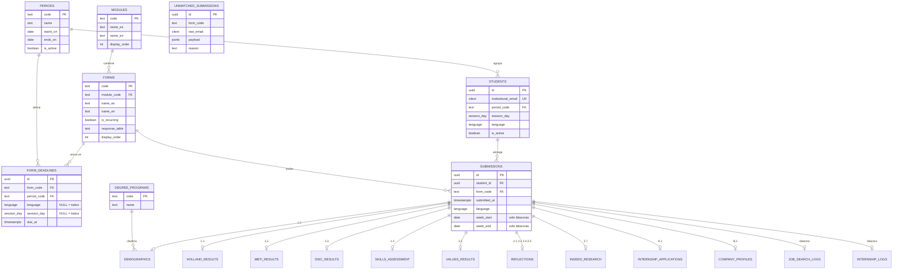

# Esquema de la base de datos

> **Fuente única de verdad del modelo de datos.**
> Todo cambio al esquema se refleja aquí en el mismo commit que la migración SQL.
> Ver la regla 1 de [CLAUDE.md](../CLAUDE.md).

- **Motor:** PostgreSQL 15+ (Supabase)
- **Estado:** definido en `supabase/migrations/`, **aún no ejecutado**
- **Última actualización:** migración `0006_views.sql`

## Índice

1. [Principios de diseño](#principios-de-diseño)
2. [Diagrama entidad-relación](#diagrama-entidad-relación)
3. [Tipos enumerados](#tipos-enumerados)
4. [Tablas de catálogo](#tablas-de-catálogo)
5. [Tablas núcleo](#tablas-núcleo)
6. [Módulo 1 — Conócete](#módulo-1--conócete)
7. [Módulo 2 — Actúa](#módulo-2--actúa)
8. [Apéndices y bitácoras](#apéndices-y-bitácoras)
9. [Vistas](#vistas)
10. [Índices](#índices)
11. [Seguridad (RLS)](#seguridad-rls)

---

## Principios de diseño

### 1. Llave sustituta, correo como llave natural

En el Google Sheets actual la llave foránea es el **correo institucional del alumno**
(`idCorreo`), repetido en las 15 hojas de formularios. Aquí:

- `students.id` (`uuid`) es la PK y lo que usan todas las relaciones.
- `students.institutional_email` (`citext UNIQUE`) conserva la llave natural y es
  lo que se usa al importar desde el Sheets.

Así, si un alumno cambia de correo, se actualiza una sola fila en lugar de romper
todas las relaciones.

### 2. `submissions` es la tabla central

Toda respuesta a un formulario crea una fila en `submissions`. Las tablas de
respuestas (`demographics`, `holland_results`, …) cuelgan de `submission_id`.

**Consecuencias:**

- Un alumno puede tener **N respuestas del mismo formulario**. Esto es indispensable
  para las bitácoras semanales (`form_practicas` tiene hasta 10 respuestas por
  alumno en los datos actuales) y protege al resto de los formularios contra
  reenvíos que sobrescriban la versión anterior.
- El estado de entregas (*a tiempo / tarde / pendiente*) se calcula desde
  `submissions` × `form_deadlines`, sin consultar cada tabla de formulario.
- Los metadatos comunes (`submitted_at`, `language`, `week_start`, `week_end`) viven
  en un solo lugar.

> **Nunca** agregar `UNIQUE (student_id, form_code)` a `submissions`.

### 3. Los correos huérfanos no se pierden

En los datos actuales hay de 2 a 4 filas por hoja cuyo `idCorreo` **no existe** en
la hoja `alumnos`. Un FK estricto tiraría esas filas durante la importación, así que
van a `unmatched_submissions` para revisión manual.

### 4. Enums normalizados, texto libre en `text`

El Sheets tiene valores inconsistentes (`Femenino`/`Femenine`, `Extravertido`/
`Extrovertido`, `Sí`/`Si`). Los enums de Postgres los fuerzan a un valor único; la
normalización ocurre en la importación y está documentada en
[DATA_MAPPING.md](DATA_MAPPING.md).

### 5. Fidelidad con el origen donde conviene

`skills_assessment` usa 33 columnas anchas, réplica exacta de la hoja `form1_4`, en
lugar de una tabla normalizada. Decisión tomada a propósito: agregar una habilidad
requiere `ALTER TABLE`.

---

## Diagrama entidad-relación



> `UNMATCHED_SUBMISSIONS` aparece sin relaciones a propósito: es una tabla de
> staging, precisamente para filas que **no** pudieron ligarse a un alumno.

---

## Tipos enumerados

Definidos en `supabase/migrations/0001_enums.sql`.

| Tipo | Valores | Origen en el Sheets |
|---|---|---|
| `language` | `es`, `en` | `Español`, `Inglés` |
| `session_day` | `lunes`, `miercoles` | `Lunes`, `Miércoles` |
| `gender` | `femenino`, `masculino`, `otro`, `no_especificado` | `Femenino`, `Femenine`, `Masculino` |
| `skill_level` | `novato`, `principiante`, `intermedio`, `avanzado`, `experto` | idénticos |
| `holland_type` | `R`, `I`, `A`, `S`, `E`, `C` | `R (Realista)`, … |
| `mbti_type` | `INTJ`, `INTP`, `ENTJ`, `ENTP`, `INFJ`, `INFP`, `ENFJ`, `ENFP`, `ISTJ`, `ISFJ`, `ESTJ`, `ESFJ`, `ISTP`, `ISFP`, `ESTP`, `ESFP` | 16 columnas en español |
| `mbti_energy` | `extravertido`, `introvertido` | `Extravertido`, `Extrovertido` |
| `mbti_mind` | `intuitivo`, `observador` | idénticos |
| `mbti_nature` | `pensamiento`, `emocional` | idénticos |
| `mbti_tactics` | `juzgador`, `prospeccion` | `Juzgador`, `Prospección` |
| `mbti_identity` | `asertivo`, `cauteloso` | idénticos |
| `submission_state` | `a_tiempo`, `tarde`, `pendiente`, `sin_fecha` | calculado |

`period` y `degree_program` **no** son enums: son tablas de catálogo, porque el
profesor da de alta periodos y carreras nuevas sin migración.

---

## Tablas de catálogo

### `periods`

| Columna | Tipo | Notas |
|---|---|---|
| `code` | `text` PK | `PR-26`, `OT-26` |
| `name` | `text` NOT NULL | `Primavera 2026` |
| `starts_on` | `date` | |
| `ends_on` | `date` | |
| `is_active` | `boolean` NOT NULL DEFAULT `true` | |

### `degree_programs`

| Columna | Tipo | Notas |
|---|---|---|
| `code` | `text` PK | `LMEC`, `LMI` |
| `name` | `text` NOT NULL | |

### `modules`

| Columna | Tipo | Notas |
|---|---|---|
| `code` | `text` PK | `1`, `2`, `A`, `B`, `W` |
| `name_es` / `name_en` | `text` NOT NULL | `Conócete` / `Know Yourself` |
| `display_order` | `int` NOT NULL | orden en el sidebar |

### `forms`

Catálogo de los 15 formularios. Ver [FORMS_CATALOG.md](FORMS_CATALOG.md).

| Columna | Tipo | Notas |
|---|---|---|
| `code` | `text` PK | `form1_0`, `form2_7`, … (los del Sheets) |
| `module_code` | `text` FK → `modules.code` | |
| `name_es` / `name_en` | `text` NOT NULL | |
| `display_order` | `numeric` NOT NULL | `1.0`, `2.7` |
| `is_recurring` | `boolean` NOT NULL DEFAULT `false` | `true` = bitácora semanal |
| `response_table` | `text` | tabla donde viven las respuestas |

---

## Tablas núcleo

### `students`

Equivale a la hoja `alumnos` (42 filas).

| Columna | Tipo | Notas |
|---|---|---|
| `id` | `uuid` PK DEFAULT `gen_random_uuid()` | |
| `institutional_email` | `citext` NOT NULL **UNIQUE** | llave natural, `@udem.edu` |
| `period_code` | `text` FK → `periods.code` | |
| `session_day` | `session_day` | grupo de sesión |
| `language` | `language` | idioma del formulario |
| `is_active` | `boolean` NOT NULL DEFAULT `true` | |
| `created_at` / `updated_at` | `timestamptz` NOT NULL DEFAULT `now()` | |

> El **nombre y la matrícula no viven aquí**: llegan en el formulario 1.0 y viven en
> `demographics`. La app los lee vía `v_students_directory`.

### `form_deadlines`

Equivale a la hoja `fechas_entrega`, cuyo `id` era `formulario___periodo`.

| Columna | Tipo | Notas |
|---|---|---|
| `id` | `uuid` PK | |
| `form_code` | `text` NOT NULL FK → `forms.code` | |
| `period_code` | `text` NOT NULL FK → `periods.code` | |
| `language` | `language` NULL | **NULL = aplica a todos los idiomas** |
| `session_day` | `session_day` NULL | **NULL = aplica a todos los grupos** |
| `due_at` | `timestamptz` NOT NULL | |
| `created_at` | `timestamptz` NOT NULL DEFAULT `now()` | |

`UNIQUE NULLS NOT DISTINCT (form_code, period_code, language, session_day)` —
permite una fecha general y excepciones por idioma o grupo sin duplicados.

### `submissions`

| Columna | Tipo | Notas |
|---|---|---|
| `id` | `uuid` PK DEFAULT `gen_random_uuid()` | |
| `student_id` | `uuid` NOT NULL FK → `students.id` ON DELETE CASCADE | |
| `form_code` | `text` NOT NULL FK → `forms.code` | |
| `submitted_at` | `timestamptz` NOT NULL | `marcaTemporal` del Sheets |
| `language` | `language` | idioma en que se respondió |
| `week_start` | `date` NULL | solo bitácoras |
| `week_end` | `date` NULL | solo bitácoras |
| `source_row_key` | `text` NULL UNIQUE | idempotencia de importación |
| `created_at` | `timestamptz` NOT NULL DEFAULT `now()` | |

`UNIQUE (student_id, form_code, submitted_at)` — evita importar dos veces la misma
respuesta, **sin** limitar a una respuesta por formulario.

### `unmatched_submissions`

Staging de filas cuyo correo no corresponde a ningún alumno.

| Columna | Tipo | Notas |
|---|---|---|
| `id` | `uuid` PK | |
| `form_code` | `text` NOT NULL | |
| `raw_email` | `citext` | correo tal cual venía |
| `submitted_at` | `timestamptz` | |
| `payload` | `jsonb` NOT NULL | fila completa sin procesar |
| `reason` | `text` | `email_no_registrado`, `email_vacio`, … |
| `resolved_at` | `timestamptz` NULL | |

---

## Módulo 1 — Conócete

Todas comparten `submission_id uuid PRIMARY KEY REFERENCES submissions(id) ON DELETE CASCADE`.

### `demographics` — 1.0 Datos Demográficos (`form1_0`)

| Columna | Tipo | Origen |
|---|---|---|
| `submission_id` | `uuid` PK FK | |
| `full_name` | `text` | `nombre` |
| `student_number` | `text` | `matricula` — **`text`, no numérico**: es un identificador |
| `personal_email` | `citext` | `correoPersonal` |
| `birth_date` | `date` | `fechaNacimiento` |
| `birth_country` | `text` | `paisNacimiento` (texto libre: `Mexico`, `MX`, `Colombia`) |
| `gender` | `gender` | `sexo` |
| `degree_code` | `text` FK → `degree_programs.code` | `carrera` |
| `semester` | `smallint` CHECK 1–12 | `semestre` (`6to` → `6`) |
| `period_code` | `text` FK → `periods.code` | `periodo` |
| `session_day` | `session_day` | `frecuencia` |

### `holland_results` — 1.1 Intereses Profesionales (`form1_1`)

| Columna | Tipo | Origen |
|---|---|---|
| `first_type` / `second_type` / `third_type` | `holland_type` | `primerPuntaje`, … |
| `holland_code` | `text` CHECK `^[RIASEC]{3}$` | `codigoHolland` |
| `first_score` / `second_score` / `third_score` | `smallint` | `primerPuntacion`, … |

### `mbti_results` — 1.2 Personalidad (`form1_2`)

Las 16 columnas en español de la hoja se colapsan en dos campos.

| Columna | Tipo | Origen |
|---|---|---|
| `report_url` | `text` | `link` |
| `mbti_type` | `mbti_type` | la columna de las 16 que tenía valor |
| `identity` | `mbti_identity` | derivado de `identidad` |
| `energy` / `mind` / `nature` / `tactics` | enums correspondientes | `energia`, `mente`, … |
| `energy_pct` … `identity_pct` | `smallint` CHECK 0–100 | `energiaPorcentaje`, … |

### `disc_results` — 1.3 Estilos de Comportamiento (`form1_3`)

| Columna | Tipo | Origen |
|---|---|---|
| `disc_style` | `text` CHECK `^[DISC]{1,4}$` (case-insensitive) | `discStyle` |
| `disc_category` | `text` | `discCategoria` |
| `explanation` | `text` | `explicacion` |
| `needs_review` | `boolean` NOT NULL DEFAULT `false` | marca filas con valores inválidos |

> `needs_review` existe porque la hoja tiene respuestas contaminadas — ver
> [DATA_MAPPING.md](DATA_MAPPING.md#form1_3--disc).

### `skills_assessment` — 1.4 Formulario de Habilidades (`form1_4`)

33 columnas `skill_level` (**decisión de columnas anchas**, regla 6 de CLAUDE.md):

`written_communication`, `verbal_communication`, `nonverbal_communication`,
`collaboration_teamwork`, `leadership`, `conflict_resolution`, `negotiation`,
`active_listening`, `empathy`, `customer_service`, `excel`, `sheets`, `word`,
`docs`, `powerpoint`, `slides`, `chatgpt`, `gemini`, `programming`,
`critical_thinking`, `decision_making`, `time_management`, `planning_organization`,
`research_analysis`, `creativity_innovation`, `flexibility_adaptability`,
`work_ethic`, `financial_literacy`, `project_management`, `learning_ability`,
`emotional_intelligence`, `networking`, `sales`

Más `is_pefista_graduating boolean` (origen `PefistaYGraduando`: `Sí`/`Si`/`No`).

### `values_results` — 1.5 Valores (`form1_5`)

| Columna | Tipo | Origen |
|---|---|---|
| `report_url` | `text` | `link` |
| `top_values` | `text[]` | `valoresFuertes` (`"Seguridad, Logro"` → `{Seguridad,Logro}`) |
| `score` | `smallint` | `puntuacion` |

---

## Módulo 2 — Actúa

### `reflections` — 2.1, 2.2, 2.4, 2.5

Los cuatro formularios (`form2_1` FODA, `form2_2` CV, `form2_4` Cover Letter,
`form2_5` Elevator Pitch) tienen exactamente la misma forma: `util` + `porque`.
Comparten una sola tabla; el formulario se distingue por `submissions.form_code`.

| Columna | Tipo | Origen |
|---|---|---|
| `submission_id` | `uuid` PK FK | |
| `was_useful` | `boolean` | `util` (`Sí`/`Si` → `true`, `No` → `false`) |
| `reason` | `text` | `porque` |

### `indeed_research` — 2.7 Indeed (`form2_7`)

| Columna | Tipo | Origen |
|---|---|---|
| `positions` | `text` | `3puestos` (multilínea, 3 puestos con sueldo) |
| `position_url_1` / `_2` / `_3` | `text` | `link1`, `link2`, `link3` |
| `companies` | `text` | `3companias` (multilínea) |
| `company_url_1` / `_2` / `_3` | `text` | `comp1`, `comp2`, `comp3` |

> `positions` y `companies` se guardan como texto multilínea tal cual los captura el
> alumno. Separarlos en filas requeriría adivinar el formato y no aporta a la vista
> del profesor.

---

## Apéndices y bitácoras

**Esquema definido, pantallas fuera del alcance de esta iteración.**
Se incluyen para no rehacer el modelo después.

### `internship_applications` — A.1 Carta Formal de Aceptación (`formA_1`)

`required_hours smallint`, `internship_option text`, `restrictions text`,
`company_name text`, `company_website text`, `company_tax_id text`,
`company_founded_year smallint`, `department text`, `supervisor_name text`,
`supervisor_role text`, `supervisor_email citext`, `supervisor_phone text`,
`schedule text`, `is_paid boolean`, `description text`, `career_relation text`,
`professional_relation text`, `company_validation text`

### `company_profiles` — B.1 Formulario de Inicio (`formB_1`)

`company_name text`, `company_website text`, `industry text`, `mission text`,
`vision text`, `company_values text`, `address text`, `weekly_hours smallint`,
`department text`, `supervisor_info text`, `supervisor_email citext`,
`supervisor_phone text`, `activities text`, `has_contract boolean`,
`salary numeric(12,2)`, `has_linkedin_profile boolean`,
`linkedin_connections int`, `linkedin_url text`

### `job_search_logs` — Bitácora de búsqueda (`form_busqueda`) · `is_recurring`

`activities text`, `applications text`, `interviews text`, `learnings text`,
`next_steps text` — la semana vive en `submissions.week_start` / `week_end`.

### `internship_logs` — Bitácora de prácticas (`form_practicas`) · `is_recurring`

`activities text`, `hours numeric(5,2)`, `skills text`, `proposal text`

> **Los teléfonos, RFC y sueldos de estas tablas son datos sensibles.** No se
> exportan ni se muestran fuera del panel del profesor.

---

## Vistas

Definidas en `supabase/migrations/0006_views.sql`.

### `latest_submissions`

Última respuesta de cada alumno por formulario.

```sql
SELECT DISTINCT ON (student_id, form_code) *
FROM submissions
ORDER BY student_id, form_code, submitted_at DESC;
```

Es la base de todas las pantallas de tabla, que muestran **una fila por alumno**.
El perfil del alumno consulta `submissions` directamente para el historial completo.

### `v_students_directory`

`students` + nombre, matrícula, carrera y semestre desde la `demographics` más
reciente. Es lo que alimenta el buscador y los filtros compartidos.

### `v_submission_status`

Producto cartesiano `students × forms` cruzado con `latest_submissions` y
`form_deadlines`, resolviendo la fecha más específica aplicable
(`session_day` > `language` > general). Devuelve `submission_state`:

| Estado | Condición |
|---|---|
| `a_tiempo` | hay respuesta y `submitted_at <= due_at` |
| `tarde` | hay respuesta y `submitted_at > due_at` |
| `pendiente` | no hay respuesta |
| `sin_fecha` | no existe deadline configurado para ese formulario y periodo |

Alimenta la pantalla "Estado de Entregas" y los contadores de cada módulo.

---

## Índices

| Índice | Tabla | Para qué |
|---|---|---|
| `students_email_key` | `students (institutional_email)` | UNIQUE, búsqueda por correo |
| `idx_students_period` | `students (period_code)` | filtro por periodo |
| `idx_submissions_student_form` | `submissions (student_id, form_code, submitted_at DESC)` | `latest_submissions` y el historial |
| `idx_submissions_form` | `submissions (form_code, submitted_at DESC)` | pantallas por formulario |
| `idx_submissions_week` | `submissions (form_code, week_start DESC)` WHERE `week_start IS NOT NULL` | bitácoras |
| `idx_deadlines_lookup` | `form_deadlines (form_code, period_code)` | cálculo de estado |
| `idx_demographics_degree` | `demographics (degree_code, semester)` | filtros de carrera/semestre |

---

## Seguridad (RLS)

RLS habilitado en **todas** las tablas. El panel es de uso exclusivo del profesor:
no hay acceso de alumnos en esta versión.

- Rol `authenticated`: `SELECT` en todo el esquema.
- Escritura (`INSERT`/`UPDATE`/`DELETE`): solo `service_role`, usada por el proceso
  de importación desde el Sheets.
- `anon`: sin acceso a ninguna tabla.

> Las llaves de Supabase nunca se commitean. Ver la regla 2 de CLAUDE.md.

---

## Correspondencia migración → contenido

| Migración | Contenido |
|---|---|
| `0001_enums.sql` | extensiones (`citext`, `pgcrypto`) y los 12 enums |
| `0002_core.sql` | catálogos, `students`, `submissions`, `form_deadlines`, `unmatched_submissions` |
| `0003_module1.sql` | tablas 1.0 – 1.5 |
| `0004_module2.sql` | `reflections`, `indeed_research` |
| `0005_appendices.sql` | apéndices A/B y bitácoras |
| `0006_views.sql` | vistas, índices y políticas RLS |
| `0007_seed_catalogs.sql` | catálogos base (módulos, formularios, periodos, carreras) — sin datos de alumnos |
