# Esquema de la base de datos

> **Fuente única de verdad del modelo de datos.**
> Los cambios se ejecutan en el SQL Editor de Supabase (regla «Los cambios de BD
> se hacen en la interfaz» de [CLAUDE.md](../CLAUDE.md)), así que este documento
> es lo único que le da
> contexto a quien trabaje después sobre qué existe en la base y por qué.
> **Todo cambio se refleja aquí en el mismo commit que su archivo SQL.**

- **Motor:** PostgreSQL 15+ (Supabase, proyecto `sovinakodrmgxytgapry`)
- **Estado:** ✅ **ejecutado en Supabase**
- **Última migración aplicada:** `0012_views_dossier.sql` (2026-09-17)
- **Pendiente de ejecutar:** `0013_role_alumno.sql` y `0014_student_accounts.sql`
  (cuentas de alumno)
- **Datos del Sheets:** importados (46 alumnos, 580 entregas), incluidas las dos
  bitácoras semanales.

## Índice

1. [Alcance](#alcance)
2. [Principios de diseño](#principios-de-diseño)
3. [Diagrama entidad-relación](#diagrama-entidad-relación)
4. [Autenticación y roles](#autenticación-y-roles)
5. [Tipos enumerados](#tipos-enumerados)
6. [Tablas núcleo](#tablas-núcleo)
7. [Módulo 1 — Conócete](#módulo-1--conócete)
8. [Módulo 2 — Actúa](#módulo-2--actúa)
9. [Bitácoras semanales](#bitácoras-semanales)
10. [Vistas](#vistas)
11. [Índices](#índices)
12. [Seguridad](#seguridad)
13. [Correspondencia migración → contenido](#correspondencia-migración--contenido)

---

## Alcance

Esta versión cubre **autenticación**, los **11 formularios del Módulo 1 y 2**
(`form1_0` … `form2_7`) y los **dos apéndices** (`formA_1`, `formB_1`).

**Deliberadamente fuera**, para incorporarse después:

| Qué | Por qué no está |
|---|---|
| Hoja `alumnos` del Sheets | Los alumnos se derivan de los correos que responden formularios |
| Hoja `fechas_entrega` | Sin ella no hay `form_deadlines` ni estado *a tiempo / tarde* |
| Catálogos `periods`, `degree_programs`, `modules` | Por ahora esos valores son `text` |

Los apéndices ya tienen **tabla y pantalla**. Las bitácoras semanales
(`form_busqueda`, `form_practicas`) entran con `0011`: son los únicos
formularios de respuesta múltiple y no se muestran como pantalla propia, sino
dentro del expediente del alumno.

---

## Principios de diseño

### 1. El correo institucional es la llave natural

El sistema actual en Apps Script relaciona **todas** las respuestas por el correo
institucional del alumno (`idCorreo`), repetido en cada hoja. Aquí se conserva esa
llave, pero normalizada:

- `students.institutional_email` (`citext UNIQUE`) es la llave natural y lo que se
  usa al importar desde el Sheets.
- `students.id` (`uuid`) es lo que usan las relaciones, para que cambiar un correo
  no rompa las entregas.

**La lista de alumnos se deriva de los formularios.** No se importa la hoja
`alumnos`: todo correo que responde un formulario es, por definición, un alumno.
En los datos actuales eso da **46 alumnos** (4 más que la hoja `alumnos`, que
estaba desactualizada). Por eso no existe una tabla de respuestas huérfanas.

### 2. `submissions` es la tabla central

Toda respuesta crea una fila en `submissions`, y las tablas de respuestas cuelgan
de `submission_id`, nunca de `student_id`.

**Un alumno puede tener N respuestas del mismo formulario.** Hoy los 11
formularios traen una sola respuesta por alumno, pero un reenvío no debe
sobrescribir la anterior y las bitácoras semanales lo van a necesitar.

> **Nunca** agregar `UNIQUE (student_id, form_code)`.

### 3. Nadie ve nada sin ser administrador

Las políticas exigen `is_admin()`, no `authenticated`. Un usuario recién
registrado puede iniciar sesión y no ve absolutamente ningún dato. Ver
[AUTH.md](AUTH.md).

### 4. Fidelidad con el origen donde conviene

`skills_assessment` usa 33 columnas anchas, réplica exacta de la hoja `form1_4`,
en lugar de una tabla normalizada. Agregar una habilidad requiere `ALTER TABLE`.

---

## Diagrama entidad-relación

```mermaid
erDiagram
    AUTH_USERS ||--|| PROFILES     : "1 a 1"
    STUDENTS   ||--o{ SUBMISSIONS  : "entrega"
    FORMS      ||--o{ SUBMISSIONS  : "recibe"

    SUBMISSIONS ||--o| DEMOGRAPHICS      : "1.0"
    SUBMISSIONS ||--o| HOLLAND_RESULTS   : "1.1"
    SUBMISSIONS ||--o| MBTI_RESULTS      : "1.2"
    SUBMISSIONS ||--o| DISC_RESULTS      : "1.3"
    SUBMISSIONS ||--o| SKILLS_ASSESSMENT : "1.4"
    SUBMISSIONS ||--o| VALUES_RESULTS    : "1.5"
    SUBMISSIONS ||--o| REFLECTIONS       : "2.1 2.2 2.4 2.5"
    SUBMISSIONS ||--o| INDEED_RESEARCH   : "2.7"
    SUBMISSIONS ||--o| INTERNSHIP_APPLICATIONS : "A.1"
    SUBMISSIONS ||--o| COMPANY_PROFILES        : "B.1"
    SUBMISSIONS ||--o| JOB_SEARCH_LOGS : "bitácora semanal"
    SUBMISSIONS ||--o| INTERNSHIP_LOGS : "bitácora semanal"

    AUTH_USERS {
        uuid id PK "lo administra Supabase"
        text email
    }
    PROFILES {
        uuid id PK "= auth.users.id"
        citext email UK
        text full_name
        app_role role "admin | pendiente"
        boolean is_active
    }
    STUDENTS {
        uuid id PK
        citext institutional_email UK "llave natural"
    }
    FORMS {
        text code PK "form1_0 … form_practicas"
        text module_code "1 | 2 | A | B | W"
        text name_es
        text name_en
        numeric display_order
        text response_table
    }
    SUBMISSIONS {
        uuid id PK
        uuid student_id FK
        text form_code FK
        timestamptz submitted_at
        language language
        text source_row_key UK "idempotencia"
        date week_start "solo bitácoras"
        date week_end "solo bitácoras"
    }
    JOB_SEARCH_LOGS {
        uuid submission_id PK
        text activities
        text applications
        text interviews
        text learnings
        text next_steps
    }
    INTERNSHIP_LOGS {
        uuid submission_id PK
        text activities
        numeric hours_worked
        text skills_practiced
        text proposal
    }
    DEMOGRAPHICS {
        uuid submission_id PK
        text full_name
        text student_number
        citext personal_email
        date birth_date
        text birth_country
        gender gender
        text degree_code
        smallint semester
        text period_code
        session_day session_day
    }
    HOLLAND_RESULTS {
        uuid submission_id PK
        holland_type first_type
        holland_type second_type
        holland_type third_type
        text holland_code
        smallint first_score
        smallint second_score
        smallint third_score
    }
    MBTI_RESULTS {
        uuid submission_id PK
        mbti_type mbti_type
        mbti_identity identity
        mbti_energy energy
        mbti_mind mind
        mbti_nature nature
        mbti_tactics tactics
        text report_url
    }
    DISC_RESULTS {
        uuid submission_id PK
        text disc_style
        text disc_category
        text explanation
        boolean needs_review
    }
    SKILLS_ASSESSMENT {
        uuid submission_id PK
        skill_level x33_habilidades
        boolean is_pefista_graduating
    }
    VALUES_RESULTS {
        uuid submission_id PK
        text_array top_values
        smallint score
        text report_url
    }
    REFLECTIONS {
        uuid submission_id PK
        boolean was_useful
        text reason
    }
    INDEED_RESEARCH {
        uuid submission_id PK
        text positions
        text companies
    }
    INTERNSHIP_APPLICATIONS {
        uuid submission_id PK
        smallint required_hours
        text company_name
        text company_tax_id
        smallint company_founded_year
        citext supervisor_email
        text supervisor_phone
        boolean is_paid
    }
    COMPANY_PROFILES {
        uuid submission_id PK
        text company_name
        text industry
        text work_schedule
        citext supervisor_email
        text supervisor_phone
        boolean has_contract
        numeric salary
        int linkedin_connections
    }
```



> `AUTH_USERS` es `auth.users`, del esquema que administra Supabase. No se
> modifica nunca; `profiles` se le engancha por `id`.

---

## Autenticación y roles

Detalle completo en [AUTH.md](AUTH.md). Resumen del modelo:

### `profiles`

| Columna | Tipo | Notas |
|---|---|---|
| `id` | `uuid` PK → `auth.users(id)` ON DELETE CASCADE | mismo id que Supabase Auth |
| `email` | `citext` NOT NULL UNIQUE | |
| `full_name` | `text` | |
| `role` | `app_role` NOT NULL DEFAULT `'pendiente'` | |
| `is_active` | `boolean` NOT NULL DEFAULT `true` | |
| `student_id` | `uuid` → `students(id)` ON DELETE SET NULL | el alumno de la cuenta; `NULL` en el profesor. Único entre los no nulos |
| `created_at` / `updated_at` | `timestamptz` NOT NULL DEFAULT `now()` | |

### `app_role`

`admin` · `alumno` · `pendiente`

`pendiente` es el rol con el que nace todo usuario. Puede iniciar sesión y no ve
nada. Roles futuros se agregan con `ALTER TYPE app_role ADD VALUE`, y en su
**propio archivo**: PostgreSQL no deja usar un valor de enum en la misma
transacción que lo agregó. Por eso `alumno` viene solo en `0013`.

`alumno` hoy es un rol sin lectura: no hay una sola política que lo mencione, así
que un alumno con sesión no ve ni una fila —ni la suya—. Solo existen su cuenta y
su pantalla de bienvenida. Las políticas `student_id = current_student_id()`
llegan cuando lleguen sus pantallas de datos.

### Funciones y triggers

| Objeto | Qué hace |
|---|---|
| `is_admin()` | `SECURITY DEFINER`. Base de todas las políticas |
| `handle_new_user()` | Trigger sobre `auth.users`: crea el perfil en `pendiente` |
| `guard_profile_role()` | Trigger sobre `profiles`: protege la columna `role` |
| `current_student_id()` | `SECURITY DEFINER`. El alumno de la sesión, o `NULL`. Base de las políticas «lo mío» |
| `create_student_accounts()` | Alta masiva de cuentas de alumno. Se corre a mano en el SQL Editor; sin permiso de ejecución para `authenticated` |

**Por qué `is_admin()` es `SECURITY DEFINER`:** se invoca desde la política de
`profiles`; si consultara `profiles` con los permisos de quien llama, dispararía
esa misma política y Postgres entraría en recursión infinita. `SECURITY DEFINER`
se salta RLS dentro de la función y corta el ciclo. Además lleva
`set search_path = ''` para que nadie pueda suplantar `public.profiles` con un
esquema propio.

**Por qué existe `guard_profile_role()`:** RLS decide qué *filas* se pueden
modificar, pero no qué *columnas*. Sin este trigger, un usuario con permiso de
editar su propio perfil podría ascenderse a `admin`.

---

## Tipos enumerados

| Tipo | Valores | Origen en el Sheets |
|---|---|---|
| `app_role` | `admin`, `pendiente` | — (propio de la app) |
| `language` | `es`, `en` | `Español`, `Inglés` |
| `session_day` | `lunes`, `miercoles` | `Lunes`, `Miércoles` |
| `gender` | `femenino`, `masculino`, `otro`, `no_especificado` | `Femenino`, `Femenine`, `Masculino` |
| `skill_level` | `novato`, `principiante`, `intermedio`, `avanzado`, `experto` | idénticos |
| `holland_type` | `R`, `I`, `A`, `S`, `E`, `C` | `R (Realista)`, … |
| `mbti_type` | los 16 tipos (`INTJ` … `ESFP`) | 16 columnas en español |
| `mbti_energy` | `extravertido`, `introvertido` | `Extravertido`, `Extrovertido` |
| `mbti_mind` | `intuitivo`, `observador` | idénticos |
| `mbti_nature` | `pensamiento`, `emocional` | idénticos |
| `mbti_tactics` | `juzgador`, `prospeccion` | `Juzgador`, `Prospección` |
| `mbti_identity` | `asertivo`, `cauteloso` | idénticos |

> **El orden de `skill_level` importa**: define `<`, `>`, `ORDER BY` y `max()`.
> Va de menor a mayor dominio.

---

## Tablas núcleo

### `students`

| Columna | Tipo | Notas |
|---|---|---|
| `id` | `uuid` PK DEFAULT `gen_random_uuid()` | |
| `institutional_email` | `citext` NOT NULL **UNIQUE** | llave natural, `@udem.edu` |
| `created_at` / `updated_at` | `timestamptz` NOT NULL DEFAULT `now()` | |

Tabla mínima a propósito. El nombre, matrícula, carrera, semestre, periodo y
frecuencia **no viven aquí**: llegan en el formulario 1.0 y viven en
`demographics`. La app los lee con `v_students_directory`.

### `forms`

Catálogo de los 11 formularios. Ver [FORMS_CATALOG.md](FORMS_CATALOG.md).

| Columna | Tipo | Notas |
|---|---|---|
| `code` | `text` PK | `form1_0`, `form2_7` — los códigos del Sheets |
| `module_code` | `text` NOT NULL CHECK `in ('1','2')` | |
| `name_es` / `name_en` | `text` NOT NULL | |
| `display_order` | `numeric(4,1)` NOT NULL | `1.0`, `2.7` — ordena el sidebar |
| `response_table` | `text` | dónde viven las respuestas |

### `submissions`

| Columna | Tipo | Notas |
|---|---|---|
| `id` | `uuid` PK DEFAULT `gen_random_uuid()` | |
| `student_id` | `uuid` NOT NULL FK → `students.id` ON DELETE CASCADE | |
| `form_code` | `text` NOT NULL FK → `forms.code` | |
| `submitted_at` | `timestamptz` NOT NULL | `marcaTemporal` del Sheets |
| `language` | `language` | idioma en que se respondió |
| `source_row_key` | `text` UNIQUE | idempotencia de importación |
| `week_start` | `date` | **solo bitácoras.** `inicioSemana`; `NULL` en los otros 11 formularios |
| `week_end` | `date` | **solo bitácoras.** `finalSemana` |
| `created_at` | `timestamptz` NOT NULL DEFAULT `now()` | |

`UNIQUE (student_id, form_code, submitted_at)` — evita importar dos veces la
misma respuesta, **sin** limitar a una respuesta por formulario.

La semana vive aquí y no en las tablas de bitácora porque es el campo que las
**ordena**: consultar el historial de un alumno no debería obligar a unir con la
tabla de respuestas para saber en qué orden van.

`CHECK submissions_semana_plausible` acota las dos fechas a 2000–2100. **No** hay
check de `week_end >= week_start`: 6 de 183 entregas reales traen el rango
invertido y otras 12 duran entre 12 y 365 días. Son errores de captura del alumno
y el profesor necesita verlos tal como se enviaron. El check de años existe por
otra razón: atrapa la corrupción de fechas de Excel, que produce fechas de 1900.

---

## Módulo 1 — Conócete

Todas comparten `submission_id uuid PRIMARY KEY REFERENCES submissions(id) ON DELETE CASCADE`.

### `demographics` — 1.0 (`form1_0`)

| Columna | Tipo | Origen |
|---|---|---|
| `full_name` | `text` | `nombre` |
| `student_number` | `text` | `matricula` — **`text`**: es un identificador |
| `personal_email` | `citext` | `correoPersonal` |
| `birth_date` | `date` | `fechaNacimiento` |
| `birth_country` | `text` | `paisNacimiento` — texto libre (`Mexico`, `MX`, …) |
| `gender` | `gender` | `sexo` |
| `degree_code` | `text` | `carrera` — sin catálogo en esta iteración |
| `semester` | `smallint` CHECK 1–12 | `semestre` (`6to` → `6`) |
| `period_code` | `text` | `periodo` |
| `session_day` | `session_day` | `frecuencia` |

### `holland_results` — 1.1 (`form1_1`)

`first_type` / `second_type` / `third_type` (`holland_type`),
`holland_code` (`text` CHECK `^[RIASEC]{3}$`),
`first_score` / `second_score` / `third_score` (`smallint`).

### `mbti_results` — 1.2 (`form1_2`)

`report_url`, `mbti_type`, `identity`, `energy`, `mind`, `nature`, `tactics`,
y los cinco `*_pct` (`smallint` CHECK 0–100).

Las 16 columnas en español de la hoja se colapsan en `mbti_type` + `identity`.

### `disc_results` — 1.3 (`form1_3`)

`disc_style` (`text` CHECK `^[DISC]{1,4}$`), `disc_category`, `explanation`,
`needs_review` (`boolean` NOT NULL DEFAULT `false`).

> `needs_review` marca las respuestas contaminadas del formulario de origen —
> ver [DATA_MAPPING.md](DATA_MAPPING.md).

### `skills_assessment` — 1.4 (`form1_4`)

33 columnas `skill_level` más `is_pefista_graduating boolean`:

`written_communication`, `verbal_communication`, `nonverbal_communication`,
`collaboration_teamwork`, `leadership`, `conflict_resolution`, `negotiation`,
`active_listening`, `empathy`, `customer_service`, `excel`, `sheets`, `word`,
`docs`, `powerpoint`, `slides`, `chatgpt`, `gemini`, `programming`,
`critical_thinking`, `decision_making`, `time_management`,
`planning_organization`, `research_analysis`, `project_management`,
`creativity_innovation`, `flexibility_adaptability`, `work_ethic`,
`financial_literacy`, `learning_ability`, `emotional_intelligence`,
`networking`, `sales`

### `values_results` — 1.5 (`form1_5`)

`report_url` (`text`), `top_values` (`text[]`), `score` (`smallint`).

---

## Módulo 2 — Actúa

### `reflections` — 2.1, 2.2, 2.4, 2.5

Los cuatro formularios tienen las mismas dos preguntas y comparten tabla; cuál es
se sabe por `submissions.form_code`.

| Columna | Tipo | Origen |
|---|---|---|
| `was_useful` | `boolean` | `util` (`Sí`/`Si`/`Yes` → `true`) |
| `reason` | `text` | `porque` |

### `indeed_research` — 2.7 (`form2_7`)

`positions`, `position_url_1/2/3`, `companies`, `company_url_1/2/3` — todos `text`.

`positions` y `companies` se guardan como texto multilínea tal cual: el formato lo
escribe el alumno a mano y no es fiable parsearlo.

---

## Apéndices

Definidos en `0009_appendices.sql`; sus vistas de panel en `0010_views_appendices.sql`.

> Estas dos tablas contienen datos sensibles de **terceros** —teléfonos y correos
> de jefes, RFC de empresas y sueldos—, no solo de alumnos. No se exportan ni se
> muestran fuera del panel del profesor.

### `internship_applications` — A.1 Carta Formal de Aceptación (`formA_1`)

| Columna | Tipo | Origen / nota |
|---|---|---|
| `required_hours` | `smallint` CHECK 0–2000 | `horas`. **El origen mezcla número y texto**: hay `240` y también `"480 horas voy todos los días 9am"`. Se guarda el número extraído |
| `internship_option` | `text` | `opcionesPracticas` |
| `restrictions` | `text` | |
| `company_name` / `company_website` | `text` | |
| `company_tax_id` | `text` | RFC. Sin formato validado: hay filas donde se capturó el nombre de la empresa |
| `company_founded_year` | `smallint` CHECK 1800–2100 | `anioEmpresa`. El origen trae número, texto (`"Aprox 1976"`) y fechas |
| `department` | `text` | |
| `supervisor_name` / `supervisor_role` | `text` | |
| `supervisor_email` | `citext` | |
| `supervisor_phone` | `text` | Conserva lada y separadores: `+52-833-155-6372`, `81 1468 3544` |
| `schedule` | `text` | |
| `is_paid` | `boolean` | `renumeracion` (sic) |
| `description`, `career_relation`, `professional_relation`, `company_validation` | `text` | |

### `company_profiles` — B.1 Formulario de Inicio (`formB_1`)

| Columna | Tipo | Origen / nota |
|---|---|---|
| `company_name` | `text` | `empresa` |
| `company_website` | `text` | |
| `industry` | `text` | `giro` |
| `mission`, `vision` | `text` | |
| `company_values` | `text` | **con prefijo**: `values` es palabra reservada en SQL |
| `address` | `text` | `direccionEmpresa` |
| `work_schedule` | `text` | `horarioLaboral`. **Texto descriptivo, no un número de horas**: `"Lunes a Viernes (9am a 4pm)"` |
| `department` | `text` | |
| `supervisor_info` | `text` | `datosJefe`: nombre y puesto en un solo campo |
| `supervisor_email` | `citext` | |
| `supervisor_phone` | `text` | |
| `activities` | `text` | |
| `has_contract` | `boolean` | `contrato`: `Si`/`Sí`/`Yes` |
| `salary` | `numeric(12,2)` CHECK ≥ 0 | |
| `has_linkedin_profile` | `boolean` | |
| `linkedin_connections` | `int` CHECK ≥ 0 | |
| `linkedin_url` | `text` | |

---

## Bitácoras semanales

> Migración `0011_weekly_logs.sql`. Los **únicos** formularios de respuesta
> múltiple: un alumno acumula hasta 10 entregas. Por eso `submissions` nunca
> llevó `UNIQUE (student_id, form_code)`.

No tienen pantalla propia en el rail. Se leen dentro del **expediente del
alumno**, igual que en la plataforma anterior, donde eran las secciones
«Reporte de Búsqueda» y «Reporte de Prácticas» de la tarjeta *ADN Profesional*.

La semana reportada no está en estas tablas, sino en `submissions.week_start` /
`week_end`.

### `job_search_logs` — Reporte de Búsqueda (`form_busqueda`)

| Columna | Tipo | Origen |
|---|---|---|
| `submission_id` | `uuid` PK FK → `submissions.id` ON DELETE CASCADE | |
| `activities` | `text` | `actividades` |
| `applications` | `text` | `aplicaciones` |
| `interviews` | `text` | `entrevistas` |
| `learnings` | `text` | `aprendizajes` |
| `next_steps` | `text` | `siguientesPasos` |

Todo es texto libre semanal. No se parsea a listas: el formato lo pone el alumno
y no es confiable.

### `internship_logs` — Reporte de Prácticas (`form_practicas`)

| Columna | Tipo | Origen |
|---|---|---|
| `submission_id` | `uuid` PK FK → `submissions.id` ON DELETE CASCADE | |
| `activities` | `text` | `actividades` |
| `hours_worked` | `numeric(5,1)` | `horas` |
| `skills_practiced` | `text` | `habilidades` |
| `proposal` | `text` | `propuesta` |

`hours_worked` es **decimal y no entero** porque el origen trae `'31.20'`. Excel
además convirtió 40 de las 116 celdas a fechas de 1900 —serial 20 → `1900-01-20`
→ 20 horas—; la reconversión la hace `scripts/generar_import.py`. Ver
[DATA_MAPPING.md](DATA_MAPPING.md#bitácoras-semanales).

`CHECK internship_logs_horas_plausibles` acota a 0–500. No juzga cuántas horas es
razonable trabajar (el máximo real capturado es 96): ataja lo absurdo.

> **El acumulado de horas no se guarda.** Es la suma corrida de `hours_worked` y
> se calcula al mostrarlo. Guardarlo obligaría a recalcular la columna entera
> cada vez que llega una entrega atrasada, que es justo lo que pasa con una
> bitácora.

---

## Vistas

### `latest_submissions`

Última respuesta de cada alumno por formulario.

```sql
SELECT DISTINCT ON (student_id, form_code) …
FROM submissions
ORDER BY student_id, form_code, submitted_at DESC;
```

Base de las pantallas de tabla, que muestran **una fila por alumno**. El panel del
alumno consulta `submissions` directamente para el historial completo.

### `v_students_directory`

`students` + los datos demográficos de la respuesta más reciente al `form1_0`.
Alimenta el buscador y los filtros compartidos.

> Ambas vistas llevan `security_invoker = on`. Sin eso se ejecutarían con los
> permisos de su propietario y **serían una puerta trasera que se salta RLS**.

### Vistas de panel — `v_panel_*`

Una por pantalla. Cada una entrega **una fila por alumno con su respuesta
vigente**, ya unida con los datos del alumno, para que el frontend haga un
`select` plano con filtros.

| Vista | Pantalla | Formulario |
|---|---|---|
| `v_panel_demographics` | 1.0 Datos Demográficos | `form1_0` |
| `v_panel_holland` | 1.1 Intereses Profesionales | `form1_1` |
| `v_panel_mbti` | 1.2 Personalidad | `form1_2` |
| `v_panel_disc` | 1.3 Estilos de Comportamiento | `form1_3` |
| `v_panel_skills` | 1.4 Formulario de Habilidades | `form1_4` |
| `v_panel_values` | 1.5 Valores | `form1_5` |
| `v_panel_reflections` | 2.1, 2.2, 2.4, 2.5 | los cuatro, se filtra por `form_code` |
| `v_panel_indeed` | 2.7 Indeed | `form2_7` |
| `v_panel_internships` | A.1 Carta Formal de Aceptación | `formA_1` |
| `v_panel_companies` | B.1 Formulario de Inicio | `formB_1` |

Todas exponen las mismas columnas de filtrado (`institutional_email`,
`language`, `session_day`, `degree_code`, `semester`, `period_code`), así que el
filtrado es idéntico en las 11 pantallas.

`v_panel_demographics` es la única que no se apoya en `v_students_directory`:
sus propios datos **son** los demográficos, y tomarlos de ahí sería circular.

Todas llevan `security_invoker = on`.

### Vistas de expediente — el alumno, no el formulario

> Migración `0012_views_dossier.sql`.

Las `v_panel_*` responden *«¿quiénes contestaron este formulario?»*. Estas tres
responden la contraria: *«¿qué sé de este alumno?»*, que es lo que se abre al
hacer clic en su nombre desde cualquier pantalla.

| Vista | Filas | Qué junta |
|---|---|---|
| `v_student_dossier` | 1 por alumno | demográficos + Holland + MBTI + DISC + Valores + datos de la práctica (B.1) |
| `v_student_job_search_logs` | N por alumno | la bitácora de búsqueda completa |
| `v_student_internship_logs` | N por alumno | la bitácora de prácticas, con horas acumuladas |

**`v_student_dossier` usa `LEFT JOIN` en todo.** Un alumno que solo contestó el
1.0 tiene que aparecer igual, con el resto en `NULL`: un `INNER JOIN` escondería
justo a los alumnos que el profesor necesita perseguir.

**Las dos vistas de bitácora no pasan por `latest_submissions`.** El punto de una
bitácora es verlas todas; filtrar a la última sería tirar el historial.

`cumulative_hours` y `total_hours` se calculan con funciones de ventana y **no se
guardan**. Dos decisiones dentro:

- Se ordena por **`week_start`, no por `submitted_at`**: lo que el profesor lee
  es la semana reportada. Un alumno que sube tres bitácoras el mismo día las
  acumula en el orden en que trabajó, no en el que se acordó de reportar.
- `coalesce(hours_worked, 0)` en la suma. Cuatro entregas reales no traen horas
  rescatables; sin el `coalesce` esas filas volverían `NULL` el acumulado y todo
  lo que viniera después.

### Una nota sobre `submissions_unique_response`

`UNIQUE (student_id, form_code, submitted_at)` implica que **dos bitácoras
enviadas en el mismo segundo colisionan** y la segunda se descarta en la
importación. Se revisaron las 580 filas del Sheets y no hay un solo par
`(correo, marcaTemporal)` repetido, así que hoy no pierde nada. Si algún día
aparece, la señal será que el conteo importado no cuadra con el del Sheets.

---

## Índices

| Índice | Tabla | Para qué |
|---|---|---|
| `students_institutional_email_key` | `students` | UNIQUE, búsqueda por correo |
| `idx_profiles_admins` | `profiles (id) WHERE role='admin'` | `is_admin()` |
| `idx_submissions_student_form` | `submissions (student_id, form_code, submitted_at DESC)` | `latest_submissions` y el historial |
| `idx_submissions_form` | `submissions (form_code, submitted_at DESC)` | pantallas por formulario |
| `idx_submissions_week` | `submissions (student_id, form_code, week_start DESC) WHERE week_start IS NOT NULL` | ordena la bitácora; parcial porque solo 2 de 13 formularios la llenan |
| `idx_demographics_degree` | `demographics (degree_code, semester)` | filtros |
| `idx_disc_needs_review` | `disc_results (needs_review) WHERE needs_review` | revisión manual |

---

## Seguridad

RLS habilitado en **las 16 tablas**.

| Rol | Permisos |
|---|---|
| `anon` | ninguno |
| `authenticated` con rol `pendiente` | solo su propio `profiles` |
| `authenticated` con rol `alumno` | solo su propio `profiles`. Ninguna tabla de datos |
| `authenticated` con rol `admin` | lectura de todo |
| `service_role` | escritura (importación); se salta RLS por definición |

No hay políticas de `INSERT`/`UPDATE`/`DELETE` en las tablas de datos: RLS deniega
por omisión, así que desde el navegador no se puede escribir aunque se manipule la
petición.

### Verificado contra PostgreSQL

Las migraciones se ejecutaron en un PostgreSQL local con un *shim* del esquema
`auth` de Supabase, y se comprobó el comportamiento:

| Escenario | Resultado |
|---|---|
| Usuario `pendiente` lee tablas de datos | 0 filas |
| Usuario `pendiente` lee `profiles` | solo el suyo |
| Usuario `pendiente` intenta ascenderse | error |
| Usuario `admin` lee datos | ve todo |
| Usuario `admin` cambia su propio rol | error |
| Usuario `admin` promueve a otro | funciona |
| Usuario `anon` | permiso denegado |

> **Verificado en Supabase (2026-09-11):** las dos vistas reportan
> `security_invoker = on`, así que respetan RLS y no son una vía para saltársela.
> Era lo único que no se había podido comprobar en local, porque esa opción
> requiere PostgreSQL 15 y la validación corrió en 14.

---

## Correspondencia migración → contenido

| Migración | Contenido | ¿Ejecutada? |
|---|---|---|
| `0001_auth.sql` | `app_role`, `profiles`, `is_admin()`, triggers, RLS de `profiles` | ✅ 2026-09-11 |
| `0002_enums.sql` | los 11 enums de dominio | ✅ 2026-09-11 |
| `0003_core.sql` | `students`, `forms`, `submissions` | ✅ 2026-09-11 |
| `0004_module1.sql` | tablas 1.0 – 1.5 | ✅ 2026-09-11 |
| `0005_module2.sql` | `reflections`, `indeed_research` | ✅ 2026-09-11 |
| `0006_views_rls.sql` | índices, vistas y políticas admin-only | ✅ 2026-09-11 |
| `0007_seed_forms.sql` | catálogo de los 11 formularios | ✅ 2026-09-11 |
| `0008_views_panel.sql` | las 8 vistas `v_panel_*` que alimentan las pantallas | ✅ 2026-09-11 |
| `0009_appendices.sql` | `internship_applications`, `company_profiles`, RLS y catálogo | ✅ 2026-09-17 |
| `0010_views_appendices.sql` | `v_panel_internships`, `v_panel_companies` | ✅ 2026-09-17 |
| `0011_weekly_logs.sql` | `week_start`/`week_end`, `job_search_logs`, `internship_logs`, RLS y catálogo | ✅ 2026-09-17 |
| `0012_views_dossier.sql` | `v_student_dossier` y las dos vistas de bitácora | ✅ 2026-09-17 |
| `0013_role_alumno.sql` | valor `alumno` de `app_role` | ⏳ pendiente |
| `0014_student_accounts.sql` | `profiles.student_id`, `current_student_id()`, `create_student_accounts()` | ⏳ pendiente |

> **Un archivo ejecutado ya no se edita.** Cualquier cambio posterior es un
> archivo nuevo.

### Estado verificado en Supabase tras la ejecución

| Objeto | Cantidad |
|---|---|
| Tablas | 16 |
| Tablas con RLS activo | **16** |
| Políticas | 18 |
| Vistas | 15, todas con `security_invoker = on` |
| Índices `idx_*` | 6 |
| Formularios en el catálogo | 15 |
| Alumnos | 46 |
| Entregas | 580 |
| Entregas de bitácora | 183 (67 búsqueda + 116 prácticas) |
| Horas de prácticas registradas | 3 032.2 en 112 de 116 entregas |
